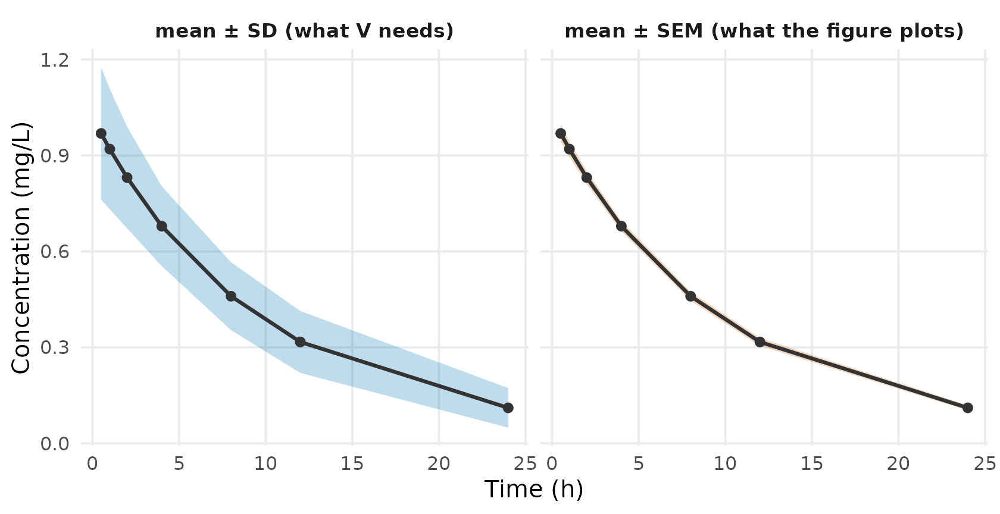

# From a published figure to E, V and n

## The problem

Every study passed to
[`admControl()`](https://leidenpharmacology.github.io/admixr2/reference/admControl.md)
needs a mean vector `E`, a covariance `V`, a sample size `n`, the
observation `times` and a dosing event table `ev`. A published figure
gives you a mean and an error bar.

Reading the mean off is easy. Getting the variance right is where
aggregate analyses go wrong: a standard error used as a standard
deviation is off by a factor of `sqrt(n)`, and the fit does not tell you
— the structural parameters come back correct and only the
between-subject variability collapses. This vignette converts a
published figure into `E`, `V` and `n`, and shows what that mistake
costs.

``` r

library(admixr2)
library(rxode2)
library(nlmixr2)
library(ggplot2)
```

## What V must be

`V` is the spread across *subjects*, not the precision of the mean.
admixr2’s likelihood is

``` math
-2LL = n \left( \log|V_{pred}| + \mathrm{tr}(V_{pred}^{-1} V_{obs}) + r^{\top} V_{pred}^{-1} r \right)
```

where `r` is the mismatch between observed and predicted means, and
`V_pred = J Omega J' + Sigma` — one subject’s covariance, built from the
between-subject variability and the residual error. `V_obs` must be the
same object, and the sample size `n` sits outside it. Hand the
likelihood a standard error squared and you have told it about `n`
twice.

So `V = SD^2`, never `SEM^2`.

## What is the error bar?

Read the caption. If it does not say, treat the error bar as unknown
rather than assuming:

| Figure reports | Convert to SD | Note |
|----|----|----|
| Standard deviation (SD) | `SD` | Use directly |
| Standard error (SEM) | `SD = SEM * sqrt(n)` | Off by `sqrt(n)` if confused |
| 95% CI of the mean | `SD = (upper - lower) * sqrt(n) / 3.92` | 3.92 = 2 × 1.96; for small `n` use `2 * qt(0.975, n - 1)` |
| Interquartile range | `SD ~ IQR / 1.35` | Assumes normality |
| LS-mean SE (from an MMRM) | `SD ~ SE * sqrt(n)` | Biased small — see below |

``` r

sd_from_sem <- function(sem, n)        sem * sqrt(n)
sd_from_ci  <- function(lower, upper, n) (upper - lower) * sqrt(n) / (2 * qt(0.975, n - 1))
sd_from_iqr <- function(q1, q3)        (q3 - q1) / 1.35
```

An LS-mean SE deserves care because it is the one row that can silently
reproduce the error this vignette is about. It comes out of a model,
usually an MMRM: baseline and covariate adjustment remove variance from
the residual, and the covariance structure borrows across visits, so
`SE * sqrt(n)` is usually **smaller** than the true between-subject SD —
the same direction as mistaking a SEM for an SD. It also describes
whatever the MMRM modelled, often a change from baseline rather than an
absolute value. Prefer a descriptive SD from the paper’s own baseline
table, or from a comparable study.

## A figure reporting standard errors

A 50 mg arm, 60 subjects, digitised from a concentration–time figure
whose caption reads “mean ± SEM” — the same arm used in [PD and PK/PD
data](https://leidenpharmacology.github.io/admixr2/articles/pkpd.md),
before it was fitted:

``` r

times <- c(0.5, 1, 2, 4, 8, 12, 24)
E     <- c(0.969, 0.920, 0.831, 0.679, 0.460, 0.317, 0.111)     # mg/L
SEM   <- c(0.0267, 0.0243, 0.0205, 0.0161, 0.0137, 0.0125, 0.0080)
n     <- 60L

SD <- sd_from_sem(SEM, n)
round(SD, 3)
#> [1] 0.207 0.188 0.159 0.125 0.106 0.097 0.062
```

The bars the figure plots are `sqrt(60)` — nearly eight times — smaller
than the standard deviations the fit needs. Plotting both makes it
concrete: the SEM band is far too tight to be a between-subject spread.

``` r

band <- rbind(
  data.frame(t = times, m = E, lo = E - SD,  hi = E + SD,  what = "mean ± SD (what V needs)"),
  data.frame(t = times, m = E, lo = E - SEM, hi = E + SEM, what = "mean ± SEM (what the figure plots)"))

ggplot(band, aes(t, m)) +
  geom_ribbon(aes(ymin = lo, ymax = hi, fill = what), alpha = 0.25) +
  geom_line(linewidth = 0.9, colour = "grey20") +
  geom_point(size = 1.8, colour = "grey20") +
  facet_wrap(~ what) +
  scale_fill_manual(values = c("mean ± SD (what V needs)"          = "#0072B2",
                               "mean ± SEM (what the figure plots)" = "#D55E00"),
                    guide = "none") +
  labs(x = "Time (h)", y = "Concentration (mg/L)") +
  theme_minimal(base_size = 12) +
  theme(panel.grid.minor = element_blank(),
        strip.text = element_text(face = "bold", size = 10))
```



Passing `V` as a plain vector of variances is enough; admixr2 expands it
to a diagonal matrix and sets `method = "var"`:

``` r

study <- list(E = E, V = SD^2, n = n, times = times,
              ev = rxode2::et(amt = 50, cmt = "central"))
```

``` r

pk_model <- function() {
  ini({
    tcl <- log(4)  ; label("Log clearance (L/h)")
    tv  <- log(40) ; label("Log volume (L)")
    prop.cp <- 0.1 ; label("Proportional residual error")
    eta.cl ~ 0.09
    eta.v  ~ 0.04
  })
  model({
    cl <- exp(tcl + eta.cl)
    v  <- exp(tv  + eta.v)
    d/dt(central) <- -(cl/v) * central
    cp <- central / v
    cp ~ prop(prop.cp)
  })
}
```

``` r
fit <- nlmixr2(pk_model, admData(), est = "adgh",
               control = adghControl(studies = list(mg50 = study)))
fit
── nlmixr² adgh ──

          OBJF       AIC       BIC Log-likelihood
adgh -1323.146 -1313.146 -1292.945       661.5729

── Time (sec fit$time): ──

        optimize covariance elapsed other
elapsed    0.495      0.047   0.542 2.709

── Population Parameters (fit$parFixed or fit$parFixedDf): ──

                          Parameter    Est.      SE   %RSE
tcl             Log clearance (L/h)   1.556 0.01954  1.256
tv                   Log volume (L)   3.911 0.01546 0.3953
prop.cp Proportional residual error 0.09764               
        Back-transformed(95%CI) BSV(CV%) Shrink(SD)%
tcl         4.738 (4.56, 4.923)     25.9            
tv          49.96 (48.47, 51.5)     19.7            
prop.cp                 0.09764                     
 
  Covariance Type (fit$covMethod): r
  No correlations in between subject variability (BSV) matrix
  Full BSV covariance (fit$omega) or correlation (fit$omegaR; diagonals=SDs) 
  Distribution stats (mean/skewness/kurtosis/p-value) available in fit$shrink 
  Censoring (fit$censInformation): No censoring
  Minimization message (fit$message):  
    NLOPT_XTOL_REACHED: Optimization stopped because xtol_rel or xtol_abs (above) was reached. 
```

## What reading SEM as SD costs

Now make the mistake: use the plotted `SEM` as if it were an `SD`, so
`V` is `n`-fold too small.

``` r
fit_wrong <- nlmixr2(
  pk_model, admData(), est = "adgh",
  control = adghControl(studies = list(
    mg50 = list(E = E, V = SEM^2, n = n, times = times,   # WRONG: SEM^2 as V
                ev = rxode2::et(amt = 50, cmt = "central")))))
fit_wrong
── nlmixr² adgh ──

          OBJF       AIC       BIC Log-likelihood
adgh -2942.689 -2932.689 -2912.488       1471.344

── Time (sec fit_wrong$time): ──

  optimize covariance elapsed
1    1.036      0.042   1.078

── Population Parameters (fit_wrong$parFixed or fit_wrong$parFixedDf): ──

                          Parameter     Est.       SE    %RSE
tcl             Log clearance (L/h)    1.558 0.003057  0.1962
tv                   Log volume (L)    3.908 0.002135 0.05464
prop.cp Proportional residual error 0.008208                 
        Back-transformed(95%CI) BSV(CV%) Shrink(SD)%
tcl         4.749 (4.72, 4.777)     4.18            
tv            49.79 (49.58, 50)     2.94            
prop.cp                0.008208                     
 
  Covariance Type (fit_wrong$covMethod): r
  No correlations in between subject variability (BSV) matrix
  Full BSV covariance (fit_wrong$omega) 
    or correlation (fit_wrong$omegaR; diagonals=SDs)
  Distribution stats (mean/skewness/kurtosis/p-value) available in $shrink 
  Censoring (fit_wrong$censInformation): No censoring
  Minimization message (fit_wrong$message):  
    NLOPT_XTOL_REACHED: Optimization stopped because xtol_rel or xtol_abs (above) was reached. 
```

Clearance and volume are unchanged to three figures. The between-subject
variability is not:

``` r

round(diag(fit$omega) / diag(fit_wrong$omega), 1)
#> eta.cl  eta.v 
#>   37.1   44.4
```

`Omega` shrinks by more than an order of magnitude on both random
effects, because the model is asked to reproduce a between-subject
spread `n` times tighter than the real one.
`V_pred = J Omega J' + Sigma` is linear in `Omega` and in the residual
variance, so both shrink together and the structural parameters are free
to stay where they were. The shrinkage stops short of the full factor of
`n` only because the mean-mismatch term `r' V_pred^-1 r` does not
rescale.

Nothing in the *point estimates* warns you. The *precision* does:

``` r

round(c(RSE_CL_correct = fit$parFixedDf["tcl", "%RSE"],
        RSE_CL_wrong   = fit_wrong$parFixedDf["tcl", "%RSE"]), 3)
#> RSE_CL_correct   RSE_CL_wrong 
#>          1.256          0.196
```

Clearance comes back not just right but implausibly certain — its
standard error tightens about 6.4-fold, of order `sqrt(n)`. An RSE that
looks too good for digitised literature data, or an IIV that comes back
near zero, is the tell.

Two things make this worse than the demo suggests:

- **The structural parameters only survive because this model fits.**
  With a misspecified model, `r` is not zero, and a `V_pred` that is `n`
  times too small weights that mismatch `n` times too heavily — dragging
  the structural estimates to close a gap they cannot close.
- **In a multi-study fit, one bad `V` captures the whole fit.** Getting
  `V` wrong in a single study inflates that study’s weight in the joint
  likelihood roughly `n`-fold. It then dominates every other arm and
  biases the shared parameters. This is the usual way admixr2 is used,
  and it is where the mistake is most expensive.

## Why V is usually diagonal

A figure gives one error bar per time point and nothing about how the
times covary, so the off-diagonal entries of `V` are not available from
published summaries. A diagonal `V` selects `method = "var"`, which
skips the Cholesky solve the full-covariance path needs. This is the
honest default for literature data. The full-covariance path is
available when you have the subject-level matrix and can compute
`cov.wt(dv_mat, method = "ML")$cov` — see [Getting
started](https://leidenpharmacology.github.io/admixr2/articles/admixr2.md).

Note the denominator. admixr2’s likelihood wants the ML (`n`) variance,
while a published SD is the unbiased (`n - 1`) sample SD, so strictly
`V = SD^2 * (n - 1) / n`. At `n = 60` that is a 1.7% change and is
usually ignored; below `n` of about 15 it is worth applying. The
`method = "ML"` rule matters most when you compute `V` yourself from
subject-level data.

## Sample size

`n` is the number of subjects contributing to the summary, per arm — not
the total across arms, and not the number of observations.

- **Dropout.** `n` often falls over time, so a figure’s late points may
  rest on fewer subjects than its early ones. Convert each point’s error
  bar with the `n` that applies to it, and pass the number contributing
  to the observations you are fitting — the number at risk, not the
  number randomised.
- **Per-endpoint `n`.** PK and PD are not always measured in the same
  people. A study’s `observations` entries may each carry their own `n`.

## Absolute values or change from baseline?

Many PD papers report a least-squares-mean change from baseline rather
than an absolute value. Either can be fitted, but the model must predict
the same quantity as the data:

- Fitting absolute values needs a baseline parameter in the model; see
  [PD and PK/PD
  data](https://leidenpharmacology.github.io/admixr2/articles/pkpd.md).
- Fitting a change means the model output must itself be a change, and
  the SD of the change — not of the absolute value — is the one `V`
  needs.

Studies that report different quantities must be converted to a common
one before fitting, not after.

## When there is no variability at all

A paper often gives a mean with no SD, SEM or CI — a placebo arm
reported only in a footnote, for example.

You then have to assume a `V`, and it is worth knowing what that
assumption does. Refit the arm above with the SD deliberately wrong in
each direction:

``` r

assume <- function(mult) {
  f <- nlmixr2(pk_model, admData(), est = "adgh",
               control = adghControl(studies = list(
                 mg50 = list(E = E, V = (SD * mult)^2, n = n, times = times,
                             ev = rxode2::et(amt = 50, cmt = "central")))))
  c(exp(f$theta[["tcl"]]), exp(f$theta[["tv"]]),
    diag(f$omega)[["eta.cl"]], diag(f$omega)[["eta.v"]])
}

mults <- c(0.5, 1, 2, 4)
res   <- t(vapply(mults, assume, numeric(4)))

tbl <- data.frame(
  `Assumed SD` = c("0.5x  (too small)", "1x  (correct)",
                   "2x  (too large)",   "4x  (too large)"),
  CL           = round(res[, 1], 2),
  V            = round(res[, 2], 2),
  `var(eta.cl)` = round(res[, 3], 3),
  `var(eta.v)`  = round(res[, 4], 3),
  check.names  = FALSE
)

knitr::kable(tbl, row.names = FALSE,
             caption = "Fit against a deliberately wrong V. Truth: CL = 5, V = 50, var(eta.cl) = 0.09, var(eta.v) = 0.04.")
```

| Assumed SD       |   CL |     V | var(eta.cl) | var(eta.v) |
|:-----------------|-----:|------:|------------:|-----------:|
| 0.5x (too small) | 4.74 | 49.89 |       0.017 |      0.010 |
| 1x (correct)     | 4.74 | 49.96 |       0.065 |      0.038 |
| 2x (too large)   | 4.78 | 49.85 |       0.264 |      0.111 |
| 4x (too large)   | 1.82 |  0.85 |       0.029 |      5.937 |

Fit against a deliberately wrong V. Truth: CL = 5, V = 50, var(eta.cl) =
0.09, var(eta.v) = 0.04. {.table}

`Omega` follows the assumption in whichever direction it is wrong: too
small and the between-subject variability collapses, too large and it
inflates several-fold. `V` is data the model must reproduce, not a
weight — so an assumed `V` is an assumption about the IIV you are trying
to estimate, and it propagates to every study through the shared
`Omega`. Push it far enough and the fit stops being sensible at all: at
`4x` the structural parameters leave the building.

There is no safe direction to err in. In rough order of preference:

1.  Take the variability from a comparable arm, or a comparable study of
    the same endpoint.
2.  Use a published typical SD for that endpoint and population.
3.  Exclude the study.

Whichever you choose, record it, and refit across the range you consider
plausible. If the estimates move, the assumption is doing the work and
the result belongs in a sensitivity table rather than a headline.

## Notes

- **The error bar is the dominant error source.** Digitisation software
  is accurate to a few percent; mistaking a SEM for an SD is an error of
  `sqrt(n)`. Reading the caption matters more than the pixels.
- **Geometric means.** A paper reporting a geometric mean and CV% is
  describing a log-normal distribution, while `E` and `V` are arithmetic
  moments. Convert before fitting.
- **Digitising.** WebPlotDigitizer is the usual tool. Extracting a
  figure twice and comparing is a cheap check.
- **`%RSE` is on the estimation scale.** These parameters are log-scale,
  so an RSE on `tcl` is not an RSE on clearance.
- **PD specifics** — baselines, placebo arms, two endpoints — are
  covered in [PD and PK/PD
  data](https://leidenpharmacology.github.io/admixr2/articles/pkpd.md).
