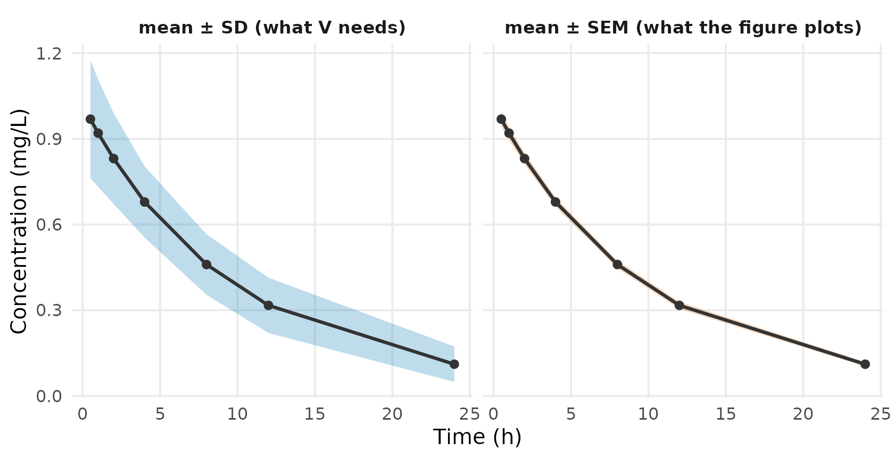

# From a published figure to E, V and n

## The problem

Every study passed to
[`admControl()`](https://leidenpharmacology.github.io/admixr2/reference/admControl.md)
needs a mean vector `E`, a covariance `V`, a sample size `n`, the
observation `times` and a dosing event table `ev`. A published figure
gives you a mean and an error bar.

The mean is easy. The variance is where aggregate analyses go wrong: a
standard error used as a standard deviation is off by `sqrt(n)`, and the
fit will not tell you — the structural parameters come back correct and
only the between-subject variability collapses. This vignette turns a
figure into `E`, `V` and `n`, and shows what that mistake costs.

``` r

library(admixr2)
library(rxode2)
library(nlmixr2)
library(ggplot2)
```

## What V must be

`V` is the spread across *subjects*, not the precision of the mean.
admixr2’s likelihood is

``` math
-2LL = n \left( \log|V_{pred}| + \mathrm{tr}(V_{pred}^{-1} V_{obs}) + r^{\top} V_{pred}^{-1} r \right)
```

where `r` is the mismatch between observed and predicted means and
`V_pred = J Omega J' + Sigma` is ONE subject’s covariance, built from
the between-subject variability and the residual error. `V_obs` must be
the same object, with `n` sitting outside it. Hand the likelihood a
standard error squared and you have told it about `n` twice.

So `V = SD^2`, never `SEM^2`.

## What is the error bar?

Read the caption. If it does not say, treat the error bar as unknown
rather than assuming:

| Figure reports | Convert to SD | Note |
|----|----|----|
| Standard deviation (SD) | `SD` | Use directly |
| Standard error (SEM) | `SD = SEM * sqrt(n)` | Off by `sqrt(n)` if confused |
| 95% CI of the mean | `SD = (upper - lower) * sqrt(n) / (2 * qt(0.975, n - 1))` | the divisor tends to 3.92 = 2 × 1.96 as `n` grows |
| Interquartile range | `SD ~ IQR / 1.35` | Assumes normality |
| LS-mean SE (from an MMRM) | `SD ~ SE * sqrt(n)` | Biased small — see below |

``` r

sd_from_sem <- function(sem, n)        sem * sqrt(n)
sd_from_ci  <- function(lower, upper, n) (upper - lower) * sqrt(n) / (2 * qt(0.975, n - 1))
sd_from_iqr <- function(q1, q3)        (q3 - q1) / 1.35
```

The LS-mean SE is the row that can silently reproduce the error this
vignette is about. It comes out of a model, usually an MMRM: baseline
and covariate adjustment strip variance from the residual and the
covariance structure borrows across visits, so `SE * sqrt(n)` usually
comes out **smaller** than the true between-subject SD — the same
direction as mistaking a SEM for an SD. It also describes whatever the
MMRM modelled, often a change from baseline rather than an absolute
value. Prefer a descriptive SD from the paper’s own baseline table, or
from a comparable study.

## A figure reporting standard errors

A 50 mg arm, 60 subjects, digitised from a concentration–time figure
whose caption reads “mean ± SEM” — the same arm used in [PD and PK/PD
data](https://leidenpharmacology.github.io/admixr2/articles/pkpd.md),
before it was fitted:

``` r

times <- c(0.5, 1, 2, 4, 8, 12, 24)
E     <- c(0.969, 0.920, 0.831, 0.679, 0.460, 0.317, 0.111)     # mg/L
SEM   <- c(0.0267, 0.0243, 0.0205, 0.0161, 0.0137, 0.0125, 0.0080)
n     <- 60L

SD <- sd_from_sem(SEM, n)
round(SD, 3)
#> [1] 0.207 0.188 0.159 0.125 0.106 0.097 0.062
```

The plotted bars are `sqrt(n)` — nearly eight times — smaller than the
standard deviations the fit needs. Side by side, the SEM band is
obviously too tight to be a between-subject spread.

``` r

band <- rbind(
  data.frame(t = times, m = E, lo = E - SD,  hi = E + SD,  what = "mean ± SD (what V needs)"),
  data.frame(t = times, m = E, lo = E - SEM, hi = E + SEM, what = "mean ± SEM (what the figure plots)"))

ggplot(band, aes(t, m)) +
  geom_ribbon(aes(ymin = lo, ymax = hi, fill = what), alpha = 0.25) +
  geom_line(linewidth = 0.9, colour = "grey20") +
  geom_point(size = 1.8, colour = "grey20") +
  facet_wrap(~ what) +
  scale_fill_manual(values = c("mean ± SD (what V needs)"          = "#0072B2",
                               "mean ± SEM (what the figure plots)" = "#D55E00"),
                    guide = "none") +
  labs(x = "Time (h)", y = "Concentration (mg/L)") +
  theme_minimal(base_size = 12) +
  theme(panel.grid.minor = element_blank(),
        strip.text = element_text(face = "bold", size = 10))
```



Passing `V` as a plain vector of variances is enough; admixr2 expands it
to a diagonal matrix and sets `method = "var"`:

``` r

study <- list(E = E, V = SD^2, n = n, times = times,
              ev = rxode2::et(amt = 50, cmt = "central"))
```

``` r

pk_model <- function() {
  ini({
    tcl <- log(4)  ; label("Log clearance (L/h)")
    tv  <- log(40) ; label("Log volume (L)")
    prop.cp <- 0.1 ; label("Proportional residual error")
    eta.cl ~ 0.09
    eta.v  ~ 0.04
  })
  model({
    cl <- exp(tcl + eta.cl)
    v  <- exp(tv  + eta.v)
    d/dt(central) <- -(cl/v) * central
    cp <- central / v
    cp ~ prop(prop.cp)
  })
}
```

``` r
fit <- nlmixr2(pk_model, admData(), est = "adgh",
               control = adghControl(studies = list(mg50 = study)))
fit
── nlmixr² adgh ──

          OBJF       AIC       BIC Log-likelihood
adgh -1323.144 -1313.144 -1292.943       661.5719

── Time (sec fit$time): ──

        optimize covariance other elapsed other
elapsed    0.481      0.149     0    0.63 2.974

── Population Parameters (fit$parFixed or fit$parFixedDf): ──

                          Parameter    Est.      SE   %RSE
tcl             Log clearance (L/h)   1.556 0.03364  2.162
tv                   Log volume (L)   3.911 0.02645 0.6762
prop.cp Proportional residual error 0.09732 0.05383  55.31
            Back-transformed(95%CI) BSV(CV%) Shrink(SD)%
tcl            4.738 (4.436, 5.061)    25.77         NaN
tv             49.96 (47.44, 52.62)    19.68         NaN
prop.cp 0.09732 (-0.008190, 0.2028)                     
 
  Covariance Type (fit$covMethod): r,s
  Some strong fixed parameter correlations exist (fit$cor) :
                cor:tv,tcl        cor:prop.cp,tcl      cor:om.eta.cl,tcl 
               0.0148                -0.0733                 0.0492  
      cor:om.eta.v,tcl         cor:prop.cp,tv       cor:om.eta.cl,tv 
               0.0447                 -0.138                 0.0845  
       cor:om.eta.v,tv  cor:om.eta.cl,prop.cp   cor:om.eta.v,prop.cp 
                0.117                 -0.592                 -0.831  
cor:om.eta.v,om.eta.cl 
                0.469  
 

  No correlations in between subject variability (BSV) matrix
  Full BSV covariance (fit$omega) or correlation (fit$omegaR; diagonals=SDs) 
  Distribution stats (mean/skewness/kurtosis/p-value) available in fit$shrink 
  Censoring (fit$censInformation): No censoring
  Minimization message (fit$message):  
    NLOPT_FTOL_REACHED: Optimization stopped because ftol_rel or ftol_abs (above) was reached. 
```

## What reading SEM as SD costs

Now make the mistake: use the plotted `SEM` as if it were an `SD`, so
`V` is `n`-fold too small.

``` r
fit_wrong <- nlmixr2(
  pk_model, admData(), est = "adgh",
  control = adghControl(studies = list(
    mg50 = list(E = E, V = SEM^2, n = n, times = times,   # WRONG: SEM^2 as V
                ev = rxode2::et(amt = 50, cmt = "central")))))
fit_wrong
── nlmixr² adgh ──

          OBJF       AIC       BIC Log-likelihood
adgh -2942.688 -2932.688 -2912.487       1471.344

── Time (sec fit_wrong$time): ──

        optimize covariance other elapsed other
elapsed    0.654      0.121     0   0.775 0.022

── Population Parameters (fit_wrong$parFixed or fit_wrong$parFixedDf): ──

                          Parameter     Est.       SE   %RSE
tcl             Log clearance (L/h)    1.558 0.005669 0.3639
tv                   Log volume (L)    3.908 0.004580 0.1172
prop.cp Proportional residual error 0.008208 0.003649  44.46
             Back-transformed(95%CI) BSV(CV%) Shrink(SD)%
tcl             4.749 (4.696, 4.802)    4.181         NaN
tv              49.79 (49.34, 50.24)    2.935         NaN
prop.cp 0.008208 (0.001056, 0.01536)                     
 
  Covariance Type (fit_wrong$covMethod): r,s
  Some strong fixed parameter correlations exist (fit_wrong$cor) :
                cor:tv,tcl        cor:prop.cp,tcl      cor:om.eta.cl,tcl 
               0.0139                 -0.780                  0.118  
      cor:om.eta.v,tcl         cor:prop.cp,tv       cor:om.eta.cl,tv 
                0.269                 -0.209                 -0.493  
       cor:om.eta.v,tv  cor:om.eta.cl,prop.cp   cor:om.eta.v,prop.cp 
                0.557                  0.134                 -0.258  
cor:om.eta.v,om.eta.cl 
               -0.345  
 

  No correlations in between subject variability (BSV) matrix
  Full BSV covariance (fit_wrong$omega) 
    or correlation (fit_wrong$omegaR; diagonals=SDs)
  Distribution stats (mean/skewness/kurtosis/p-value) available in $shrink 
  Information about run found (fit_wrong$runInfo):
   • covMethod = "r,s": the Hessian is ill-conditioned (rcond 2.4e-06, cond 4.23e+05), and the sandwich inverts it twice where "r" inverts it once -- so the correction is amplified quadratically in the weakly-identified direction, which loads mainly on `prop.cp`. Check that parameter's relative standard error before reading its "r,s" value as a finding; the well-determined parameters are unaffected. 
   • admixr2: prop.cp finished on the gradient box constraint (grad_bounds = 5 from the starting value), not at an interior optimum. The reported estimate and SE are those of a constrained fit. Widen grad_bounds, or start closer to the expected value. 
  Censoring (fit_wrong$censInformation): No censoring
  Minimization message (fit_wrong$message):  
    NLOPT_FTOL_REACHED: Optimization stopped because ftol_rel or ftol_abs (above) was reached. 
```

Clearance and volume are unchanged to three figures. The between-subject
variability is not:

``` r

round(diag(fit$omega) / diag(fit_wrong$omega), 1)
#> eta.cl  eta.v 
#>   36.8   44.1
```

`Omega` shrinks by more than an order of magnitude on both random
effects: the model is being asked to reproduce a between-subject spread
`n` times tighter than the real one. `V_pred = J Omega J' + Sigma` is
linear in `Omega` and in the residual variance, so both shrink together
and the structural parameters are free to stay put. Only the
mean-mismatch term `r' V_pred^-1 r`, which does not rescale, stops the
shrinkage short of the full factor of `n`.

Nothing in the *point estimates* warns you. The *precision* does:

``` r

round(c(RSE_CL_correct = fit$parFixedDf["tcl", "%RSE"],
        RSE_CL_wrong   = fit_wrong$parFixedDf["tcl", "%RSE"]), 3)
#> RSE_CL_correct   RSE_CL_wrong 
#>          2.162          0.364
```

Clearance comes back not just right but implausibly certain — its
standard error tightens about 5.9-fold, of order `sqrt(n)`. An RSE that
looks too good for digitised literature data, or an IIV that comes back
near zero, is the tell.

Two things make this worse than the demo suggests:

- **The structural parameters survive only because this model fits.**
  Misspecify it and `r` is not zero, so a `V_pred` that is `n` times too
  small weights that mismatch `n` times too heavily, dragging the
  structural estimates toward a gap they cannot close.
- **In a multi-study fit, one bad `V` captures everything.** It inflates
  that study’s weight in the joint likelihood roughly `n`-fold,
  whereupon it dominates every other arm and biases the shared
  parameters. That is the usual way admixr2 is used, and where the
  mistake is most expensive.

## Why V is usually diagonal

A figure gives one error bar per time point and says nothing about how
the times covary, so published summaries carry no off-diagonal entries.
A diagonal `V` selects `method = "var"` and skips the Cholesky solve —
the honest default for literature data. The full-covariance path needs
the subject-level matrix and `cov.wt(dv_mat, method = "ML")$cov`; see
[Getting
started](https://leidenpharmacology.github.io/admixr2/articles/admixr2.md).

Note the denominator, and declare it. admixr2’s likelihood is the exact
one for `n` iid draws only under the ML (`n`) covariance, while a
published SD is the unbiased (`n - 1`) one – so `V = SD^2` off a figure
is on the `n - 1` scale and strictly wants `V = SD^2 * (n - 1) / n`.

Rather than apply that by hand, say which convention the number is on:

``` r

list(E = E, V = SD^2, n = n, times = times,
     ev      = rxode2::et(amt = 50, cmt = "central"),
     v_denom = "unbiased")   # a published SD; admixr2 converts it
```

`v_denom` defaults to `"ml"` — what `cov.wt(method = "ML")` and
[`datagen()`](https://leidenpharmacology.github.io/admixr2/articles/datagen.md)
produce — so nothing changes for data you computed yourself. It is **per
study**, because a meta-analysis routinely mixes a digitised figure with
a model-derived source and the two need not agree.

At `n = 60` the factor is 1.7%. It grows as `n` falls, and it stops
being cosmetic for any method that scores the reported covariance
against its own sampling law rather than treating it as a sufficient
statistic.

## Sample size

`n` is the number of subjects contributing to the summary, per arm — not
the total across arms, and not the number of observations.

- **Dropout.** `n` falls over time, so a figure’s late points may rest
  on fewer subjects than its early ones. Convert each error bar with the
  `n` that applies to it, and pass the number contributing to the
  observations you are fitting — at risk, not randomised.
- **Per-endpoint `n`.** PK and PD are not always measured in the same
  people, so each `observations` entry may carry its own `n`.

## Absolute values or change from baseline?

Many PD papers report a least-squares-mean change from baseline rather
than an absolute value. Either can be fitted, so long as the model
predicts the same quantity as the data:

- Absolute values need a baseline parameter in the model; see [PD and
  PK/PD
  data](https://leidenpharmacology.github.io/admixr2/articles/pkpd.md).
- A change means the model output must itself be a change, and `V` wants
  the SD of the change, not of the absolute value.

Studies reporting different quantities must be converted to a common one
before fitting, not after.

## When there is no variability at all

A paper often gives a mean with no SD, SEM or CI — a placebo arm in a
footnote, say. You then have to assume a `V`, so it is worth knowing
what that assumption does. Refit the arm above with the SD deliberately
wrong in each direction:

``` r

assume <- function(mult) {
  f <- nlmixr2(pk_model, admData(), est = "adgh",
               control = adghControl(studies = list(
                 mg50 = list(E = E, V = (SD * mult)^2, n = n, times = times,
                             ev = rxode2::et(amt = 50, cmt = "central")))))
  c(exp(f$theta[["tcl"]]), exp(f$theta[["tv"]]),
    diag(f$omega)[["eta.cl"]], diag(f$omega)[["eta.v"]])
}

mults <- c(0.5, 1, 2, 4)
res   <- t(vapply(mults, assume, numeric(4)))

tbl <- data.frame(
  `Assumed SD` = c("0.5x  (too small)", "1x  (correct)",
                   "2x  (too large)",   "4x  (too large)"),
  CL           = round(res[, 1], 2),
  V            = round(res[, 2], 2),
  `var(eta.cl)` = round(res[, 3], 3),
  `var(eta.v)`  = round(res[, 4], 3),
  check.names  = FALSE
)

knitr::kable(tbl, row.names = FALSE,
             caption = "Fit against a deliberately wrong V. Truth: CL = 5, V = 50, var(eta.cl) = 0.09, var(eta.v) = 0.04.")
```

| Assumed SD       |   CL |     V | var(eta.cl) | var(eta.v) |
|:-----------------|-----:|------:|------------:|-----------:|
| 0.5x (too small) | 4.74 | 49.89 |       0.017 |      0.010 |
| 1x (correct)     | 4.74 | 49.96 |       0.064 |      0.038 |
| 2x (too large)   | 4.77 | 49.86 |       0.245 |      0.103 |
| 4x (too large)   | 2.01 |  1.02 |       0.001 |      5.937 |

Fit against a deliberately wrong V. Truth: CL = 5, V = 50, var(eta.cl) =
0.09, var(eta.v) = 0.04. {.table}

`Omega` follows the assumption whichever way it is wrong: too small and
the between-subject variability collapses, too large and it inflates
several-fold. `V` is data the model must reproduce, not a weight — so
assuming one is assuming the IIV you are trying to estimate, and it
reaches every study through the shared `Omega`. Push far enough and the
fit stops being sensible: at `4x` the structural parameters leave the
building.

There is no safe direction to err in. In rough order of preference:

1.  Take the variability from a comparable arm, or a comparable study of
    the same endpoint.
2.  Use a published typical SD for that endpoint and population.
3.  Exclude the study.

Whichever you choose, record it and refit across the range you consider
plausible. If the estimates move, the assumption is doing the work, and
the result belongs in a sensitivity table rather than a headline.

## Notes

- **The error bar dominates every other error source.** Digitisation
  software is accurate to a few percent; mistaking a SEM for an SD is an
  error of `sqrt(n)`. The caption matters more than the pixels.
- **Geometric means.** A geometric mean with CV% describes a log-normal
  distribution, while `E` and `V` are arithmetic moments. Convert first.
- **Digitising.** WebPlotDigitizer is the usual tool; extracting a
  figure twice and comparing is a cheap check.
- **`%RSE` is on the estimation scale.** These parameters are log-scale,
  so an RSE on `tcl` is not an RSE on clearance.
- **PD specifics** — baselines, placebo arms, two endpoints — are
  covered in [PD and PK/PD
  data](https://leidenpharmacology.github.io/admixr2/articles/pkpd.md).

## See also

- [Multiple
  studies](https://leidenpharmacology.github.io/admixr2/articles/multiple-studies.md)
  — combine several studies into a meta-analysis
- [Simulating data & using published
  models](https://leidenpharmacology.github.io/admixr2/articles/datagen.md)
  — the other input type
- [Getting
  started](https://leidenpharmacology.github.io/admixr2/articles/admixr2.md)
