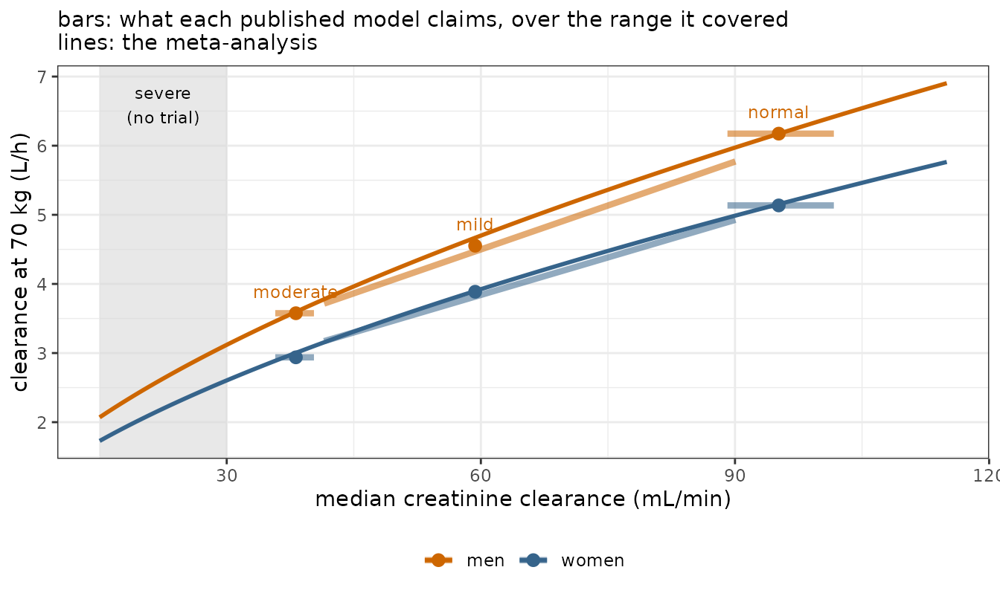

# Covariates

## The question

A woman with a creatinine clearance of 21 mL/min needs a dose. Three
trials have been published. **Two of the three fitted no renal effect**
— they enrolled narrow ranges of renal function, so within those trials
the effect is invisible, absorbed into each paper’s clearance. The third
enrolled across renal function and did estimate it.

So the evidence arrives in two different shapes, and admixr2 has to take
both: one paper that reports a renal *relationship*, and two that report
only the renal function of the patients they happened to enrol — a
contrast visible only *between* them.

## Three papers

Simulated so there is a truth to check against. Three trials, three
investigators, three models that share a drug and nothing else. Sato and
Ito enrolled narrow renal ranges and fitted no renal term; Khan enrolled
across renal function and fitted one.

| cohort   | median_CRCL | CL_at_70kg | V_at_70kg | sex_effect |
|:---------|------------:|-----------:|----------:|-----------:|
| normal   |          95 |      5.136 |    50.037 |      0.184 |
| mild     |          59 |      4.926 |    49.984 |      0.158 |
| moderate |          38 |      2.938 |    50.005 |      0.196 |

Three independent analyses, three different models, each sound on its
own data. {.table}

Clearance falls with renal function across the three papers. Only Khan’s
has a renal parameter to say so with; in the other two the effect is
buried in the clearance each reports.

## Giving admixr2 the papers

A study is a transcription of what a paper reports: its **model at its
published values**, and the **population it enrolled**. Note the
difference between the three sources, because it is the distinction the
whole method turns on:

- `normal` and `moderate` estimated no renal effect, so `CRCL` is
  **marginal** for them: they describe the patients they enrolled and
  admixr2 integrates over that. There is no contrast in either paper to
  condition on, and splitting one on a covariate its model never saw
  would manufacture evidence.
- `mild` **does** estimate it, so `CRCL` is **conditional** for that
  source and the paper can be read at values of it.

None of that is declared. admixr2 reads each source’s own model and
works it out, which is why all three calls above are identical.

The test is ESTIMATED, not merely read. All three models carry weight,
two of them at the conventional fixed exponent `(WT/70)^0.75` — and a
fixed exponent is an assumption rather than a finding, so for those two
`WT` is marginal too. Only `moderate`, which fitted its own exponent, is
conditional on it. All three fitted a sex effect, so all three are
conditional on sex. Conditioning is not cosmetic: a covariate every
study marginalises over is not identified against a random effect on the
same parameter, and over 720 replicates the likelihood-ratio test was
sized **0.125** against a nominal 0.05 with nothing conditional,
**0.058** with all three.

``` r

# --- each paper's model ----------------------------------------------------
# The source model is that analyst's own model AT their own published values,
# and a fit already is exactly that: `fit$ui` carries the model together with
# the estimates it converged on. Three different models go in, and nothing has
# to be shared between them.
#
# With a real paper you have no fit object. You write the model out yourself and
# hand admStudy() the printed numbers -- `est = c(tcl = log(5.2), ...)` -- which
# is the same study, transcribed instead of recovered.
sato_published <- fit_normal$ui        # normal renal function
ito_published  <- fit_moderate$ui      # moderate impairment
khan_published <- fit_mild$ui          # mild impairment

# --- each paper's study ----------------------------------------------------
normal_study <- admStudy(
  model      = sato_published,
  population = cohorts$normal,
  dose       = DOSE,
  times      = TIMES)

moderate_study <- admStudy(
  model      = ito_published,
  population = cohorts$moderate,
  dose       = DOSE,
  times      = TIMES)

# IDENTICAL CALL, different consequence. Khan's model uses renal function and
# the other two never mention it, so renal function is CONDITIONAL for this
# source and MARGINAL for them -- and admixr2 reads that off the models. There
# is nothing here to say it with.
mild_study <- admStudy(
  model      = khan_published,
  population = cohorts$mild,
  dose       = DOSE,
  times      = TIMES)

studies <- admStudies(normal   = normal_study,
                      moderate = moderate_study,
                      mild     = mild_study)

# the three papers together, used by the figures further down
published <- list(normal = normal_paper, mild = mild_paper,
                  moderate = moderate_paper)

studies
#> admixr2 studies: 3  (3 published models, 0 digitised)
#>   normal         model  n = 260    7 times
#>   moderate       model  n = 180    7 times
#>   mild           model  n = 210    7 times
#> 
#> covariate      normal    moderate  mild      
#>   WT           marginal  conditionalmarginal  
#>   CRCL         marginal  marginal  conditional
#>   SEX          conditionalconditionalconditional
#> 
#> NOTE: 'normal', 'moderate', 'mild' contribute as published MODELS, weighted as if `n` patients had been sampled -- `n` sets RELATIVE WEIGHT against the other studies, not precision. No standard error is reported for a fit that includes one.
#> 
#> print() a single study to check its transcription.
```

## Pooling them

``` r

adm_model <- function() {
  ini({
    tcl     <- log(4)
    tv      <- log(45)
    bcrcl   <- 0.3            # the renal effect no published model has
    bsex    <- 0.10
    add.err <- 0.1
    eta.cl  ~ 0.1
  })
  model({
    cl <- exp(tcl + eta.cl) * (WT/70)^0.75 * (CRCL/90)^bcrcl * exp(bsex * SEX)
    v  <- exp(tv) * (WT/70)
    cp <- linCmt()
    cp ~ add(add.err)
  })
}
fit <- nlmixr2(adm_model, admData(), est = "adgh",
               control = adghControl(studies = studies, print = 0L))
#> 
#> 
#> 
pf     <- fit$parFixedDf
stopifnot(abs(pf["bsex", "Estimate"] - BSEX) < 0.08)
# NO INTERVALS HERE, and that is the point: every study in this vignette is a
# published model rather than a sample, so there is no sampling law to build one
# from and admixr2 reports no standard error at all. The estimates are what the
# three papers jointly imply; whether the renal effect is real is settled by the
# likelihood-ratio test below, which needs no standard error.
knitr::kable(data.frame(
  parameter = c("CL at 70 kg, CRCL 90, women (L/h)", "V at 70 kg (L)",
                "renal exponent", "sex effect (log)", "additive SD (mg/L)",
                "omega (eta.cl)"),
  truth     = c(CL70, V70, BCRCL, BSEX, SD_ADD, OM_CL),
  estimate  = c(pf["tcl", "Back-transformed"], pf["tv", "Back-transformed"],
                pf["bcrcl", "Back-transformed"], pf["bsex", "Back-transformed"],
                pf["add.err", "Back-transformed"],
                as.numeric(fit$omega[1L, 1L]))),
  digits = 3, row.names = FALSE,
  caption = "Recovered from three analyses, none of which contained a renal term.")
```

| parameter                         | truth | estimate |
|:----------------------------------|------:|---------:|
| CL at 70 kg, CRCL 90, women (L/h) |  5.00 |    4.987 |
| V at 70 kg (L)                    | 50.00 |   50.060 |
| renal exponent                    |  0.60 |    0.591 |
| sex effect (log)                  |  0.18 |    0.180 |
| additive SD (mg/L)                |  0.08 |    0.080 |
| omega (eta.cl)                    |  0.05 |    0.065 |

Recovered from three analyses, none of which contained a renal term.
{.table}

The renal exponent comes back at 0.59 against a truth of 0.6, out of
three analyses only one of which contained a renal term — and that one
put it at 0.57. There are **no intervals**: every source here is a
published model rather than a sample, so there is no sampling law to
build one from and admixr2 reports no standard error at all.

The sex effect shows what pooling costs. The three trials reported 0.18,
0.16, 0.20 for a quantity genuinely identical in all three; sampling
noise alone put them that far apart. Reconciling that is not free — some
of it lands in the other parameters, which is why the renal exponent
comes back a little below its truth.

## Is the shape right?

Three cohorts at three renal medians settle *that* renal function
matters. They do not settle **what shape** it has. The fitted model uses
a power, `(CRCL/90)^bcrcl`, which is what generated the cohorts. Fit the
obvious alternative — linear in `CRCL` — to the same sources.

``` r

adm_model_lin <- function() {
  ini({
    tcl     <- log(4)
    tv      <- log(45)
    bcrcl   <- 0.3
    bsex    <- 0.10
    add.err <- 0.1
    eta.cl  ~ 0.1
  })
  model({
    # LINEAR in CRCL where the truth is a power -- same parameter count, so
    # there is no likelihood-ratio test to appeal to.
    cl <- exp(tcl + eta.cl) * (WT/70)^0.75 *
      (1 + bcrcl * (CRCL/90 - 1)) * exp(bsex * SEX)
    v  <- exp(tv) * (WT/70)
    cp <- linCmt()
    cp ~ add(add.err)
  })
}
fit_lin <- nlmixr2(adm_model_lin, admData(), est = "adgh",
                   control = adghControl(studies = studies, print = 0L))
#> 
#> 
#> 
```

Both models have the **same number of parameters**, so there is no
likelihood-ratio test to appeal to. All that is left is the objective,
and it decides nothing:

| form            | objective | bcrcl |
|:----------------|----------:|------:|
| power (correct) | -13334.16 |  0.59 |
| linear          | -13331.38 |  0.69 |

Same parameter count, so no LRT – and the objectives barely differ.
{.table}

    #> dOFV (linear - power) = +2.78 on 0 extra parameters

The plot decides it.

``` r

plots_lin <- plot(fit_lin, which = "covariate")
```


Between-study residual, linear model. The CRCL facet bends.


Between-study residual, linear model. The CRCL facet bends.

Three facets, and only one of them can say anything. `CRCL` separates
the sources cleanly. `SEX` is conditional, so each source contributes a
pair and the grey line joining them is the within-source contrast
conditioning bought. `WT` is the negative case: the three cohorts
enrolled median weights of 75, 77, 78 kg, so they sit on top of one
another and the facet cannot speak to weight whichever way it tips.

Note also that a mark’s size is the patients it speaks for, and that
follows the facet: on `SEX` each mark is one sex stratum, on `CRCL` the
strata are together and each mark is a whole paper.

A **missing** covariate shows up as a slope across the axis. A covariate
with the **wrong shape** shows up as **curvature** — the linear model
buys both ends by inflating `bcrcl` to 0.69, and then misses the middle.
Mean standardised residual by source, in order of increasing `CRCL` (38,
59, 95 mL/min):

| form            | moderate | mild  | normal |
|-----------------|----------|-------|--------|
| power (correct) | +0.15    | +0.36 | +0.17  |
| linear          | +0.20    | +0.25 | +0.26  |

The linear row is a **U**: both extremes above zero, the middle pulled
to zero. The power row has no such shape.

Read the magnitudes with care. Every source here is a published *model*,
so its `E` and `V` are exact functions of that model’s parameters rather
than a sample; there is no sampling noise for a residual to be large
against, and these never approach ±1.96. **The pattern is the evidence,
not the size.**

[`admMoments()`](https://leidenpharmacology.github.io/admixr2/reference/admMoments.md)
returns the moments the panels are drawn from if you want to draw your
own; see
[`vignette("diagnostic-plots")`](https://leidenpharmacology.github.io/admixr2/articles/diagnostic-plots.md).

## Seeing the renal effect

What the meta-analysis actually did. Sato’s and Ito’s models are **flat
bars** — no renal term, so each claims one clearance over the whole
range it covered. Khan’s has a slope of its own. The meta-analysis is
the line through all three.



The slope is the renal effect, recovered from three sources that each
had none. The vertical gap between the two lines is the sex effect. The
grey band is where the patient is, and no trial went there.

## The dose

| basis                   | dose_mg |
|:------------------------|--------:|
| the truth               |      76 |
| meta-analysis (admixr2) |      77 |
| nearest published model |     187 |

Dose giving a CrCl 21 mL/min patient the exposure a normal-function
patient gets from 200 mg. {.table}

The nearest published model has no renal term, so it cannot adjust for
her at all: it hands back the dose it was fitted at, for a cohort whose
median renal function was 1.8 times hers. The meta-analysis lands within
1 mg of the truth, from three papers only one of which had a renal term
to contribute.

## See also

- [Diagnostic
  plots](https://leidenpharmacology.github.io/admixr2/articles/diagnostic-plots.md)
  — what each panel is for
- [Multiple
  studies](https://leidenpharmacology.github.io/admixr2/articles/multiple-studies.md)
