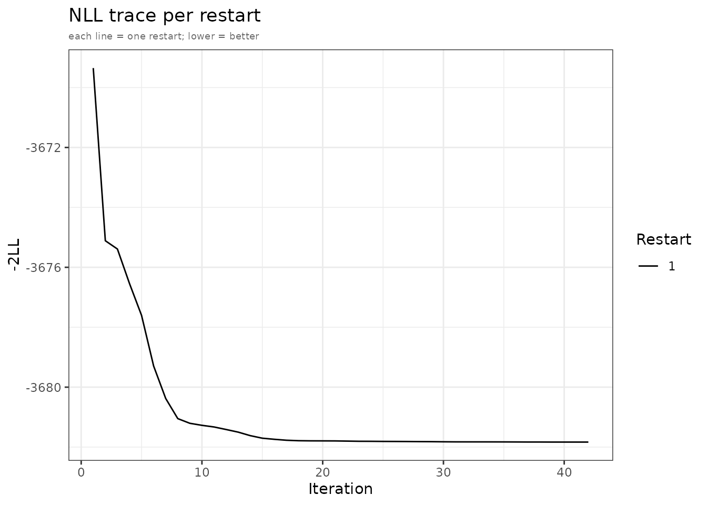
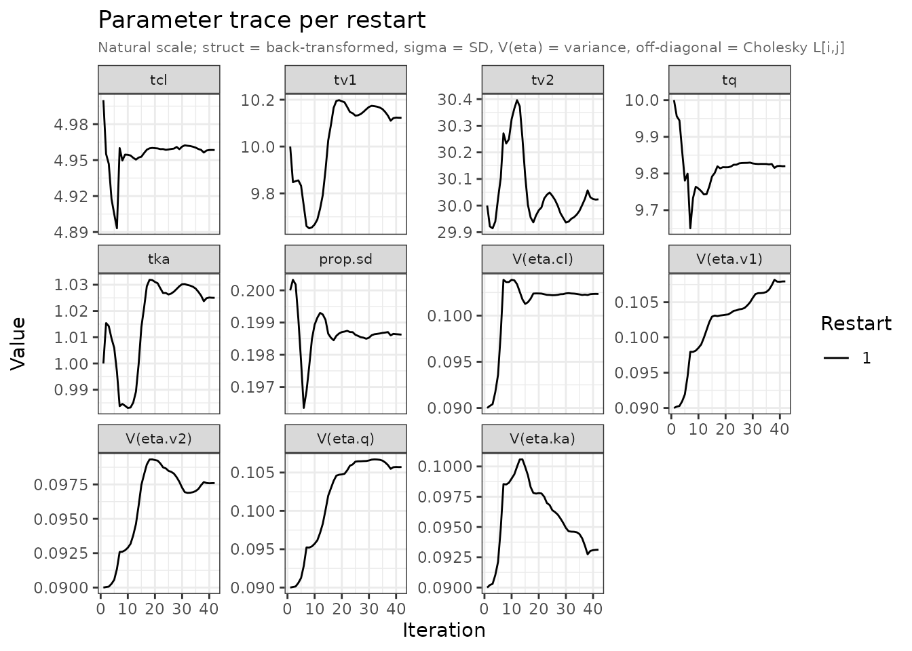

# Diagnostic plots

[`plot.admFit()`](https://leidenpharmacology.github.io/admixr2/reference/plot.admFit.md)
produces up to four diagnostic panel types. Call with `which` to select
a subset; the default is all four. Each panel is returned as a named
ggplot2 object in a list.

``` r

plots <- plot(fit, which = c("mean", "cov", "nll", "par"))
```

## Mean diagnostics

The `"mean"` panel is a 2×2 grid per study. Requires `patchwork` for the
composite layout; without it, four separate plots are returned.

``` r

plots <- plot(fit, which = "mean")
```


Mean diagnostics for the examplomycin study.

**Top-left — Observed:** sample mean with ±1 SD ribbon, where SD =
√diag(**V**\_obs).

**Top-right — Predicted:** predicted mean with ±1 SD ribbon, where SD =
√diag(**V**\_pred). **V**\_pred combines between-subject variability
(Omega) and residual error (sigma). Both top panels share the same
y-axis scale so differences in magnitude are immediately visible.

**Bottom-left — Raw residual:** `E_obs[t] − μ_pred[t]` as a lollipop.
The grey band is ±2 SE(mean), where SE = √(**V**\_pred\[t,t\] / n).
Points outside the band indicate systematic bias at that time point.

**Bottom-right — Standardised residual:** `z[t] = residual[t] / SE[t]`.
Under a well-specified model, z should be approximately N(0, 1). Stars
flag \|z\| \> 1.96 (∗), 2.58 (∗∗), 3.29 (∗∗∗). With 9 time points and no
multiplicity correction, one flagged time point is expected by chance
alone.

## Covariance diagnostics

The `"cov"` panel compares observed and predicted (co)variance as
heatmaps. Requires `patchwork` for the composite layout.

``` r

plots <- plot(fit, which = "cov")
```


Covariance diagnostics: observed and predicted covariance matrices with
residuals.

**Top row — Observed \| Predicted:** both matrices plotted on a shared
blue-white-red scale. A good fit shows matching patterns of magnitude
and sign — including the off-diagonal temporal correlation structure.

**Bottom-left — Residual (V_obs − V_pred):** diverging scale
(purple-white-teal). Persistent positive residuals on the diagonal mean
the model under-predicts variance; negative residuals indicate
over-prediction.

**Bottom-right — Standardised residual:** each entry divided by its
asymptotic SE. Diagonal SE = √(2 V\[i,i\]² / (n−1)); off-diagonal SE =
√((V\[i,i\]·V\[j,j\] + V\[i,j\]²) / (n−1)). Stars use the same
thresholds as the mean panel.

## NLL trace

The `"nll"` panel shows how the objective function evolved across
optimizer iterations, coloured by restart:

``` r

plots <- plot(fit, which = "nll")
```


NLL convergence trace. Each line is one optimizer restart.

Restarts that converge to the same final value support a unimodal
landscape. A spread of final NLL values suggests local optima — increase
`n_restarts` and `restart_sd` in
[`admControl()`](https://leidenpharmacology.github.io/admixr2/reference/admControl.md).

## Parameter trace

The `"par"` panel facets each parameter’s trajectory over optimizer
iterations:

``` r

plots <- plot(fit, which = "par")
```


Parameter trace on the natural scale. Struct thetas back-transformed;
sigma shown as SD; V(eta) = variance.

Parameters are displayed on the natural scale:

- Structural thetas: back-transformed
  (e.g. [`exp()`](https://rdrr.io/r/base/Log.html) for log-scale params)
- Sigma: displayed as SD
- Omega diagonal: displayed as variance, labelled `V(eta.x)`
- Omega off-diagonal: raw Cholesky L\[i,j\]

Smoothly converging traces that stabilise well before `maxeval` indicate
the optimizer is not being artificially cut off. If traces still drift
at the end, increase `maxeval`.

## Accessing individual panels

[`plot()`](https://rdrr.io/r/graphics/plot.default.html) returns its
list invisibly. Assign it to retrieve or modify panels:

``` r

plots <- plot(fit, which = c("nll", "par"))
```



``` r

names(plots)
#> [1] "nll_trace" "par_trace"
```

Panel names follow the pattern `<type>_<study>` for per-study panels, or
`nll_trace` / `par_trace` for the trace panels:

``` r

plots$nll_trace
plots$par_trace
plots$mean_examplomycin
plots$cov_examplomycin
```

## Customising with ggplot2

All returned objects are standard ggplot2 plots:

``` r

plots$nll_trace +
  ggplot2::theme_minimal(base_size = 13) +
  ggplot2::labs(title = "Optimiser convergence", subtitle = NULL)
```


NLL trace with a custom theme.

## IIV correlation heatmap

The estimated Omega matrix can be visualised as a correlation heatmap to
inspect the inter-individual variability structure. This is especially
informative for models with off-diagonal omega entries.

``` r

omega   <- fit$env$admExtra$omega
eta_nms <- fit$env$admExtra$eta_col_names
if (is.null(eta_nms)) eta_nms <- paste0("eta.", seq_len(nrow(omega)))

corr_mat <- cov2cor(omega)
rownames(corr_mat) <- colnames(corr_mat) <- eta_nms

df_corr <- expand.grid(
  eta_i = factor(eta_nms, levels = rev(eta_nms)),
  eta_j = factor(eta_nms, levels = eta_nms),
  stringsAsFactors = FALSE
)
df_corr$r <- as.vector(t(corr_mat))

ggplot2::ggplot(df_corr, ggplot2::aes(x = eta_j, y = eta_i, fill = r)) +
  ggplot2::geom_tile(colour = "white", linewidth = 0.5) +
  ggplot2::geom_text(ggplot2::aes(label = round(r, 2)), size = 3.2) +
  ggplot2::scale_fill_gradient2(
    low = "#2166AC", mid = "white", high = "#D6604D",
    midpoint = 0, limits = c(-1, 1), name = "r"
  ) +
  ggplot2::labs(
    title    = "IIV correlation (estimated Omega)",
    subtitle = "Off-diagonal entries are zero for a diagonal Omega model",
    x = NULL, y = NULL
  ) +
  ggplot2::theme_bw() +
  ggplot2::theme(axis.text.x = ggplot2::element_text(angle = 45, hjust = 1))
```


IIV correlation matrix derived from the estimated Omega.
