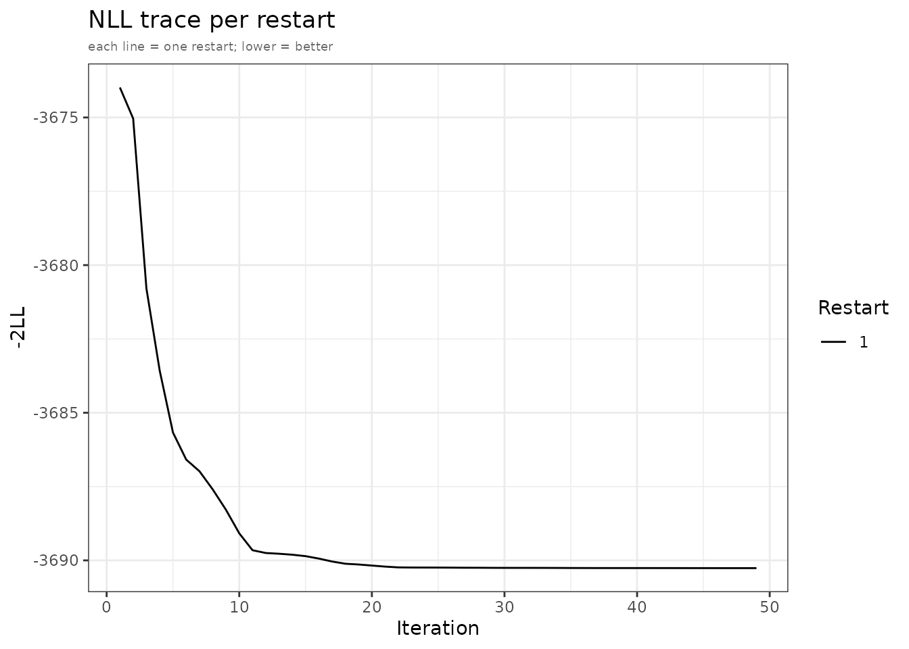
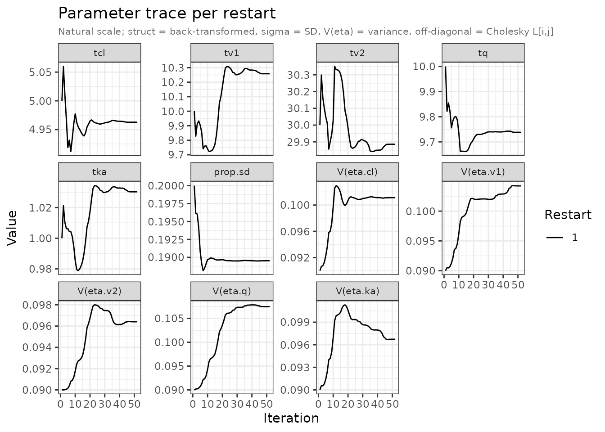

# Diagnostic plots

[`plot.admFit()`](https://leidenpharmacology.github.io/admixr2/reference/plot.admFit.md)
draws up to four panel types, all four by default. Each is returned as a
named ggplot2 object in a list.

``` r

plots <- plot(fit, which = c("mean", "cov", "nll", "par"))
```

## Mean diagnostics

A 2×2 grid per study. `patchwork` composes it; without it you get four
separate plots.

``` r

plots <- plot(fit, which = "mean")
```


Mean diagnostics for the examplomycin study.

**Top-left — Observed:** sample mean with ±1 SD ribbon, where SD =
√diag(**V**\_obs).

**Top-right — Predicted:** predicted mean with ±1 SD ribbon, where SD =
√diag(**V**\_pred), combining between-subject variability (Omega) and
residual error (sigma). Both top panels share a y-axis, so a difference
in magnitude is visible at once.

**Bottom-left — Raw residual:** `E_obs[t] − μ_pred[t]` as a lollipop.
The grey band is ±2 SE(mean), SE = √(**V**\_pred\[t,t\] / n); points
outside it are systematic bias at that time.

**Bottom-right — Standardised residual:** `z[t] = residual[t] / SE[t]`,
which a well-specified model leaves approximately N(0, 1). Stars flag
\|z\| \> 1.96 (∗), 2.58 (∗∗), 3.29 (∗∗∗). Across 9 uncorrected time
points, one flag is expected by chance.

## Covariance diagnostics

Observed against predicted (co)variance, as heatmaps. Also composed with
`patchwork`.

``` r

plots <- plot(fit, which = "cov")
```


Covariance diagnostics: observed and predicted covariance matrices with
residuals.

**Top row — Observed \| Predicted:** one shared blue-white-red scale. A
good fit matches in magnitude and sign, off-diagonal temporal structure
included.

**Bottom-left — Residual (V_obs − V_pred):** diverging
purple-white-teal. Positive on the diagonal means the model
under-predicts variance; negative, over-predicts.

**Bottom-right — Standardised residual:** each entry over its asymptotic
SE — √(2 V\[i,i\]² / (n−1)) on the diagonal, √((V\[i,i\]·V\[j,j\] +
V\[i,j\]²) / (n−1)) off it. Stars as above.

## NLL trace

The objective across optimizer iterations, coloured by restart:

``` r

plots <- plot(fit, which = "nll")
```


NLL convergence trace. Each line is one optimizer restart.

Restarts landing on the same value support a unimodal landscape; a
spread of final values suggests local optima, so raise `n_restarts` and
`restart_sd`.

## Parameter trace

One facet per parameter, over optimizer iterations:

``` r

plots <- plot(fit, which = "par")
```


Parameter trace on the natural scale. Struct thetas back-transformed;
sigma shown as SD; V(eta) = variance.

Everything is on the natural scale: structural thetas back-transformed,
sigma as an SD, the Omega diagonal as a variance labelled `V(eta.x)`,
its off-diagonal as the raw Cholesky `L[i,j]`.

Traces that flatten well before `maxeval` mean the optimizer was not cut
off. If they still drift at the end, raise `maxeval`.

## Accessing individual panels

[`plot()`](https://rdrr.io/r/graphics/plot.default.html) returns its
list invisibly; assign it to reach individual panels:

``` r

plots <- plot(fit, which = c("nll", "par"))
```



``` r

names(plots)
#> [1] "nll_trace" "par_trace"
```

Per-study panels are named `<type>_<study>`, the traces `nll_trace` and
`par_trace`. With several observed outputs the label gains the output
name — `mean_lit.plasma`, `cov_lit.brain` — so each gets its own panel:

``` r

plots$nll_trace
plots$par_trace
plots$mean_examplomycin
plots$cov_examplomycin
```

## Customising with ggplot2

All returned objects are standard ggplot2 plots:

``` r

plots$nll_trace +
  ggplot2::theme_minimal(base_size = 13) +
  ggplot2::labs(title = "Optimiser convergence", subtitle = NULL)
```


NLL trace with a custom theme.

## IIV correlation heatmap

The estimated Omega reads as a correlation heatmap, which is worth a
look whenever the model has off-diagonal omega entries.

``` r

omega   <- fit$env$admExtra$omega
eta_nms <- fit$env$admExtra$eta_col_names
if (is.null(eta_nms)) eta_nms <- paste0("eta.", seq_len(nrow(omega)))

corr_mat <- cov2cor(omega)
rownames(corr_mat) <- colnames(corr_mat) <- eta_nms

df_corr <- expand.grid(
  eta_i = factor(eta_nms, levels = rev(eta_nms)),
  eta_j = factor(eta_nms, levels = eta_nms),
  stringsAsFactors = FALSE
)
df_corr$r <- as.vector(t(corr_mat))

ggplot2::ggplot(df_corr, ggplot2::aes(x = eta_j, y = eta_i, fill = r)) +
  ggplot2::geom_tile(colour = "white", linewidth = 0.5) +
  ggplot2::geom_text(ggplot2::aes(label = round(r, 2)), size = 3.2) +
  ggplot2::scale_fill_gradient2(
    low = "#2166AC", mid = "white", high = "#D6604D",
    midpoint = 0, limits = c(-1, 1), name = "r"
  ) +
  ggplot2::labs(
    title    = "IIV correlation (estimated Omega)",
    subtitle = "Off-diagonal entries are zero for a diagonal Omega model",
    x = NULL, y = NULL
  ) +
  ggplot2::theme_bw() +
  ggplot2::theme(axis.text.x = ggplot2::element_text(angle = 45, hjust = 1))
```


IIV correlation matrix derived from the estimated Omega.

## See also

- [Getting
  started](https://leidenpharmacology.github.io/admixr2/articles/admixr2.md)
- [Multiple
  studies](https://leidenpharmacology.github.io/admixr2/articles/multiple-studies.md)
  — meta-analysis across studies
- [Estimator
  comparison](https://leidenpharmacology.github.io/admixr2/articles/estimator-comparison.md)
