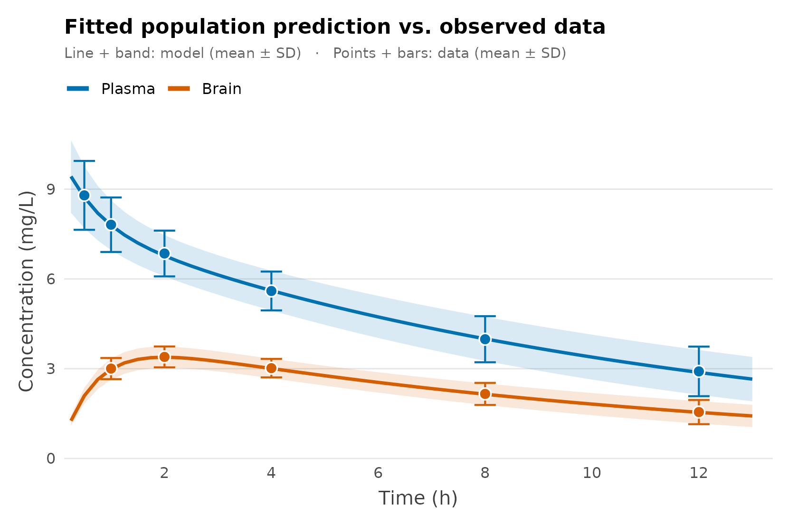
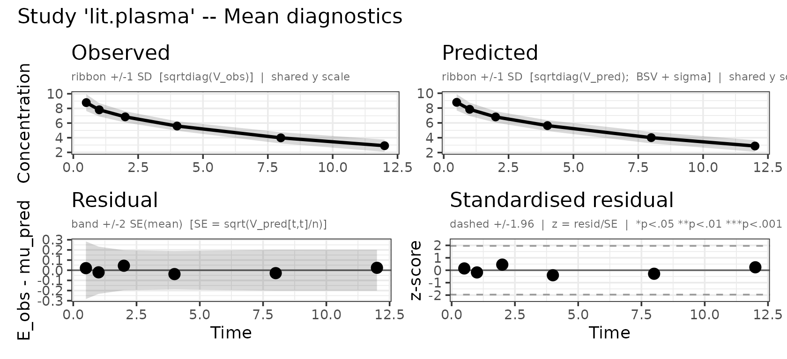
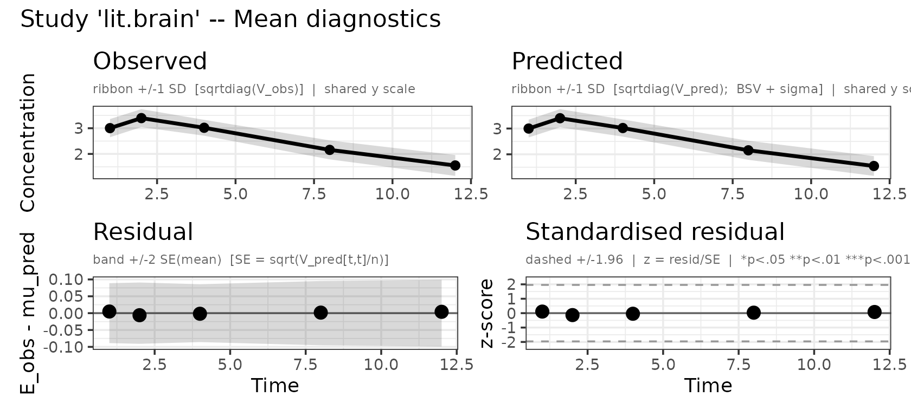

# Several observed compartments (plasma and brain)

## The problem

You are developing a CNS drug and you want one number: **how much of it
reaches the brain?** You don’t have patient-level data. What you *do*
have is a published paper with two figures — a **plasma** and a
**brain** concentration–time curve, each drawn as a mean with error
bars. You digitise them into a mean and an SD at every sampling time.

That aggregate summary is exactly what admixr2 is built for. It fits a
population PK model *directly* to means-and-covariances, so a digitised
figure becomes a fittable dataset — no individual records required. This
vignette builds the analysis in two steps:

1.  **Plasma only** — the ordinary single-output workflow, to set the
    scene.
2.  **Plasma + brain** — add the brain as a second observed output and
    read the brain-penetration ratio straight off the fit.

``` r

library(admixr2)
library(rxode2)
library(nlmixr2)
library(ggplot2)

ev <- rxode2::et(amt = 100, cmt = "central")   # single 100-unit dose, shared throughout
```

## Step 1 — Plasma only

Start where every PK analysis starts: the plasma curve. In admixr2 a
**study** is the digitised summary bundled with its design — the mean
vector `E`, its variance `V` (here `SD^2`, read as a diagonal
covariance, exactly what error bars give you), the sample size `n`, the
sampling `times`, and the dosing `ev`.

``` r

plasma_times <- c(0.5, 1, 2, 4, 8, 12)
plasma_mean  <- c(8.793, 7.812, 6.850, 5.597, 3.985, 2.910)
plasma_sd    <- c(1.151, 0.911, 0.765, 0.649, 0.770, 0.828)

plasma_study <- list(
  E = plasma_mean, V = plasma_sd^2, n = 60L,
  times = plasma_times, ev = ev
)
```

The model is an ordinary two-compartment PK model with one observed
output, `cp`. Fitting is a single call to `nlmixr2()` with
`est = "adgh"`, admixr2’s Gauss–Hermite estimator:

``` r
pk_plasma <- function() {
  ini({
    tcl <- log(1);  tv1 <- log(10);  tq <- log(3);  tv2 <- log(8)
    prop.cp <- 0.05
    eta.cl ~ 0.09
    eta.v1 ~ 0.04
  })
  model({
    cl <- exp(tcl + eta.cl); v1 <- exp(tv1 + eta.v1)
    q  <- exp(tq);           v2 <- exp(tv2)
    d/dt(central) <- -(cl/v1)*central - (q/v1)*central + (q/v2)*periph
    d/dt(periph)  <-  (q/v1)*central - (q/v2)*periph
    cp <- central / v1
    cp ~ prop(prop.cp)
  })
}

fit_plasma <- nlmixr2(pk_plasma, admData(), est = "adgh",
                      control = adghControl(studies = list(trial = plasma_study)))
fit_plasma
── nlmixr² adgh ──

         OBJF      AIC      BIC Log-likelihood
adgh 229.6289 243.6289 270.8316      -114.8144

── Time (sec fit_plasma$time): ──

        optimize covariance elapsed other
elapsed    0.545      0.083   0.628 5.042

── Population Parameters (fit_plasma$parFixed or fit_plasma$parFixedDf): ──

            Est.      SE  %RSE Back-transformed(95%CI) BSV(CV%) Shrink(SD)%
tcl      0.03322 0.03098 93.25   1.034 (0.9729, 1.098)     27.9            
tv1        2.292 0.04515  1.97      9.89 (9.052, 10.8)     15.1            
tq        0.8833  0.3714 42.05    2.419 (1.168, 5.009)                     
tv2       0.8678  0.1541 17.76    2.382 (1.761, 3.222)                     
prop.cp 0.004104                              0.004104                     
 
  Covariance Type (fit_plasma$covMethod): r
  No correlations in between subject variability (BSV) matrix
  Full BSV covariance (fit_plasma$omega) 
    or correlation (fit_plasma$omegaR; diagonals=SDs)
  Distribution stats (mean/skewness/kurtosis/p-value) available in $shrink 
  Censoring (fit_plasma$censInformation): No censoring
  Minimization message (fit_plasma$message):  
    NLOPT_XTOL_REACHED: Optimization stopped because xtol_rel or xtol_abs (above) was reached. 
```

This is a perfectly good plasma model — but look at what it *cannot*
answer. Its `periph` compartment is a mathematical distribution store:
we never measured it, and nothing connects it to the brain. To quantify
brain exposure we need brain data **and** a model with a real brain
compartment.

## Step 2 — Add the brain

Here are the brain concentrations digitised from the same paper:

``` r

brain_times <- c(1, 2, 4, 8, 12)
brain_mean  <- c(3.004, 3.394, 3.018, 2.157, 1.551)
brain_sd    <- c(0.353, 0.349, 0.309, 0.369, 0.405)
```

Now swap the anonymous peripheral compartment for a **mechanistic brain
compartment**. Drug moves plasma → brain with influx clearance `qin` and
back brain → plasma with efflux clearance `qout`. The steady-state
brain:plasma ratio is the quantity we want:

``` math
K_{p,uu} = \frac{q_{in}}{q_{out}}
```

The model now has **two** observed outputs — plasma `cp` and brain `cb`
— so it carries a residual-error term for each. (`vb`, the brain volume,
is a fixed physiological constant, not an estimated parameter.)

``` r

pk_cns <- function() {
  ini({
    tcl  <- log(1);  tv1  <- log(10)
    tqin <- log(3);  tqout <- log(6)
    prop.cp <- 0.05      # plasma residual (proportional)
    add.cb  <- 0.02      # brain residual (additive)
    eta.cl ~ 0.09
    eta.v1 ~ 0.04
  })
  model({
    cl <- exp(tcl + eta.cl); v1 <- exp(tv1 + eta.v1)
    qin <- exp(tqin);        qout <- exp(tqout)
    vb  <- 5
    d/dt(central) <- -(cl/v1)*central - (qin/v1)*central + (qout/vb)*brain
    d/dt(brain)   <-  (qin/v1)*central - (qout/vb)*brain
    cp <- central / v1        # plasma concentration
    cb <- brain   / vb        # brain concentration
    cp ~ prop(prop.cp)
    cb ~ add(add.cb)
  })
}
```

Two observed outputs means the study needs two summaries. Instead of a
single `E`/`V`, give it an **`observations` list** — one named entry per
observed compartment, each pairing a model output with its own `times`,
`E` and `V`:

``` r

cns_study <- list(
  n = 60L, ev = ev,
  observations = list(
    plasma = list(output = "cp", times = plasma_times, E = plasma_mean, V = plasma_sd^2),
    brain  = list(output = "cb", times = brain_times,  E = brain_mean,  V = brain_sd^2)
  )
)
```

The only other change is telling
[`admData()`](https://leidenpharmacology.github.io/admixr2/reference/admData.md)
which outputs to expect. Then the fit call is identical to Step 1:

``` r
fit_cns <- nlmixr2(pk_cns, admData(c("cp", "cb")), est = "adgh",
                   control = adghControl(studies = list(lit = cns_study)))
fit_cns
── nlmixr² adgh ──

          OBJF       AIC       BIC Log-likelihood
adgh -88.59286 -72.59286 -36.65494       44.29643

── Time (sec fit_cns$time): ──

        optimize covariance elapsed other
elapsed    0.647      0.171   0.818 5.528

── Population Parameters (fit_cns$parFixed or fit_cns$parFixedDf): ──

           Est.      SE   %RSE Back-transformed(95%CI) BSV(CV%) Shrink(SD)%
tcl     0.04102 0.01879   45.8    1.042 (1.004, 1.081)     27.0            
tv1       2.269 0.01029 0.4535     9.673 (9.48, 9.871)     13.9            
tqin      1.085 0.03661  3.373      2.96 (2.755, 3.18)                     
tqout      1.78 0.04209  2.364    5.932 (5.462, 6.442)                     
prop.cp 0.04852                                0.04852                     
add.cb  0.01999                                0.01999                     
 
  Covariance Type (fit_cns$covMethod): r
  No correlations in between subject variability (BSV) matrix
  Full BSV covariance (fit_cns$omega) 
    or correlation (fit_cns$omegaR; diagonals=SDs)
  Distribution stats (mean/skewness/kurtosis/p-value) available in $shrink 
  Censoring (fit_cns$censInformation): No censoring
  Minimization message (fit_cns$message):  
    NLOPT_XTOL_REACHED: Optimization stopped because xtol_rel or xtol_abs (above) was reached. 
```

## The same study in long format

If you have used nlmixr2 with [multiple
endpoints](https://nlmixr2.org/articles/multiple-endpoints.html), the
`observations` list above may feel like a detour: nlmixr2 does not group
observations into per-endpoint objects — it stacks them in **one** data
frame and labels each row with the endpoint it belongs to (`DVID` /
`CMT`).

admixr2 accepts a study written that way too. Give the study a `data`
frame with one row per observed *endpoint × time* — an endpoint column
(`DVID`, `CMT` or `output`), a time column (`TIME`), the mean (`E`) and
its variance (`V`, or an `SD` column):

``` r

cns_long <- list(
  n = 60L, ev = ev,
  data = data.frame(
    DVID = c(rep("cp", length(plasma_times)), rep("cb", length(brain_times))),
    TIME = c(plasma_times, brain_times),
    E    = c(plasma_mean,  brain_mean),
    V    = c(plasma_sd,    brain_sd)^2
  )
)
```

This is the same study, written differently — admixr2 normalises it into
exactly the same likelihood blocks, so the fits agree to the last digit:

``` r
fit_long <- nlmixr2(pk_cns, admData(c("cp", "cb")), est = "adgh",
                    control = adghControl(studies = list(lit = cns_long)))

c(observations = fit_cns$objective, long = fit_long$objective)
observations         long 
   -88.59286    -88.59286 
```

Which form to use is a matter of taste. The `observations` list keeps
each compartment’s design visibly together and is the more natural way
to write a study *by hand*. The long format is the more natural way to
write one *from data*: it is the shape you already have if your
summaries live in a spreadsheet or come out of a `dplyr` pipeline, and
it is the shape nlmixr2 itself uses.

### Same-subject data: one stacked covariance

The long format earns its keep when plasma and brain were measured in
the **same subjects**. Then the two curves are correlated, and that
correlation is information the fit should use — but it lives *between*
the compartments, so there is nowhere to put it in per-compartment `V`
matrices.

In long format there is: because every observation is just a row, the
study takes **one** covariance matrix spanning all of them — rows and
columns aligned with the rows of `data`, exactly what
`cov.wt(dv_mat, method = "ML")$cov` hands you when you still have the
subject-level matrix (`dv_mat`: one row per subject, one column per
observation, plasma columns then brain columns).

``` r

cns_joint <- list(
  n = 60L, ev = ev,
  data = data.frame(
    DVID = c(rep("cp", length(plasma_times)), rep("cb", length(brain_times))),
    TIME = c(plasma_times, brain_times),
    E    = c(plasma_mean,  brain_mean)
  ),
  V = V_joint   # 11 x 11: plasma block, brain block, and the cross-covariance
)
```

admixr2 then scores all 11 observations with a **single** multivariate
normal, simulating both compartments from shared random effects.
Supplying a study-level `V` is what marks the study as same-subject;
without one, each endpoint stays an independent likelihood block. (The
`observations` form can express this too, via a `cross` list of per-pair
blocks — see
[`?admControl`](https://leidenpharmacology.github.io/admixr2/reference/admControl.md)
— but assembling those by hand is precisely the chore the long format
removes.)

Note that the choice is a **modelling** decision, not a formatting one:
a joint fit with zero cross-covariances is *not* the same as two
independent blocks. The model predicts plasma and brain to co-vary (they
share `eta.cl` and `eta.v1`); telling it you observed no covariance is a
real statement about the data, and the likelihood will hold you to it.
Use the joint form when the compartments came from the same subjects,
the independent form when they came from different ones — here, from two
separate figures.

### Model against data

A single fit now describes both compartments. The figure overlays the
observed summaries (points, mean ± SD) with the fitted population
prediction — the mean curve and the ±SD band implied by the estimated
between-subject variability (1000 simulated subjects, residual error
excluded). Plasma and brain are distinguished by colour.

``` r

# 1. Pull the fitted estimates from the fit (standard nlmixr2 accessors).
theta <- fit_cns$theta   # fixed effects (tcl, tv1, tqin, tqout, residuals)
omega <- fit_cns$omega   # between-subject covariance (rows/cols already named)

# 2. Simulate the fitted population. We solve a plain, residual-free copy of the
#    model so the band shows between-subject variability alone -- and because a
#    multi-endpoint fit can only be re-solved with per-endpoint DVID/CMT tags,
#    whereas this gives cp and cb directly.
sim_model <- rxode2::rxode2({
  cl <- exp(tcl + eta.cl); v1 <- exp(tv1 + eta.v1)
  qin <- exp(tqin); qout <- exp(tqout); vb <- 5
  d/dt(central) <- -(cl/v1)*central - (qin/v1)*central + (qout/vb)*brain
  d/dt(brain)   <-  (qin/v1)*central - (qout/vb)*brain
  cp <- central / v1
  cb <- brain / vb
})
grid <- seq(0.25, 13, by = 0.25)
sim  <- rxode2::rxSolve(sim_model,
  params = theta[c("tcl", "tv1", "tqin", "tqout")],
  omega  = omega, nSub = 1000L,
  events = ev |> rxode2::et(grid), returnType = "data.frame")

# 3. Summarise model and data as mean +/- SD per time, per compartment.
band <- function(value)
  data.frame(time = sort(unique(sim$time)),
             mean = tapply(value, sim$time, mean),
             sd   = tapply(value, sim$time, sd))

pred <- rbind(cbind(compartment = "Plasma", band(sim$cp)),
              cbind(compartment = "Brain",  band(sim$cb)))
obs  <- rbind(
  data.frame(compartment = "Plasma", time = plasma_times, mean = plasma_mean, sd = plasma_sd),
  data.frame(compartment = "Brain",  time = brain_times,  mean = brain_mean,  sd = brain_sd))

# 4. Model (line + band) over data (points + error bars), coloured by compartment.
pal <- c(Plasma = "#0072B2", Brain = "#D55E00")   # Okabe-Ito, colour-blind safe

ggplot() +
  geom_ribbon(data = pred,
              aes(time, ymin = mean - sd, ymax = mean + sd, fill = compartment),
              alpha = 0.15) +
  geom_line(data = pred,
            aes(time, mean, colour = compartment), linewidth = 1) +
  geom_errorbar(data = obs,
                aes(time, ymin = mean - sd, ymax = mean + sd, colour = compartment),
                width = 0.4, linewidth = 0.6, show.legend = FALSE) +
  geom_point(data = obs,
             aes(time, mean, fill = compartment),
             shape = 21, colour = "white", size = 3, stroke = 0.7) +
  scale_colour_manual(values = pal, breaks = c("Plasma", "Brain")) +
  scale_fill_manual(values = pal, guide = "none") +
  scale_x_continuous(breaks = seq(0, 12, 2),
                     expand = expansion(mult = c(0.01, 0.03))) +
  scale_y_continuous(expand = expansion(mult = c(0, 0.05))) +
  coord_cartesian(ylim = c(0, NA), clip = "off") +
  guides(colour = guide_legend(override.aes = list(linewidth = 1.4))) +
  labs(x = "Time (h)", y = "Concentration (mg/L)",
       title = "Fitted population prediction vs. observed data",
       subtitle = "Line + band: model (mean ± SD)   ·   Points + bars: data (mean ± SD)",
       colour = NULL) +
  theme_minimal(base_size = 12) +
  theme(
    legend.position = "top",
    legend.justification = "left",
    legend.margin = margin(b = 2),
    plot.title = element_text(face = "bold", size = 13),
    plot.subtitle = element_text(colour = "grey40", size = 9, margin = margin(b = 9)),
    axis.title = element_text(colour = "grey25"),
    axis.title.x = element_text(margin = margin(t = 6)),
    axis.title.y = element_text(margin = margin(r = 6)),
    panel.grid.minor = element_blank(),
    panel.grid.major.x = element_blank(),
    panel.grid.major.y = element_line(colour = "grey90", linewidth = 0.4),
    plot.margin = margin(12, 16, 10, 12)
  )
```



The prediction tracks both compartments. Now the payoff — read the brain
penetration directly off the estimates:

``` r

Kp_uu <- exp(theta[["tqin"]]) / exp(theta[["tqout"]])
round(Kp_uu, 2)
#> [1] 0.5
```

`Kp,uu` ≈ 0.5: at steady state the brain sees about half the plasma
concentration. This is the whole reason the brain data was needed — with
plasma alone, `qin` and `qout` are not separately identifiable and
`Kp,uu` cannot be estimated. The brain measurements resolve it.

### Built-in diagnostics

The overlay above was assembled by hand for a custom figure, but you
don’t have to: calling
[`plot()`](https://rdrr.io/r/graphics/plot.default.html) on the fit
draws observed-vs-predicted panels directly — one per observed output.

``` r

plot(fit_cns, which = "mean")
```



## Notes

- **Estimators.** `adgh` (used here), `adfo` and `admc` all support
  several observed outputs, each with its own analytical / sensitivity
  gradient. `adirmc` does not — use one of the other three. See the
  [estimator
  comparison](https://leidenpharmacology.github.io/admixr2/articles/estimator-comparison.md)
  vignette to choose.
- **Structural vs. observed compartments.** How many compartments the
  ODEs contain is irrelevant to admixr2; what matters is how many
  outputs you *observe* and fit — one in Step 1, two in Step 2.
- **Hard-coded constants** such as `vb <- 5` keep their value; not every
  physiological constant has to be an estimated parameter.
- **Two ways to write a study.** The `observations` list and the
  long-format `data` frame are interchangeable — same normalisation,
  same likelihood, same numbers. Independent experiments can also carry
  a per-endpoint `n` column and a per-endpoint `ev` (a list of event
  tables keyed by endpoint).
- **Same-subject data.** Here plasma and brain came from separate
  figures, so they are treated as independent likelihood blocks. If they
  had instead been measured in the *same* subjects, supply the
  plasma–brain cross-covariance for a joint fit — one stacked `V` in
  long format, or a per-output-pair `cross` list with `observations`;
  see
  [`?admControl`](https://leidenpharmacology.github.io/admixr2/reference/admControl.md).

## See also

- [PD and PK/PD
  data](https://leidenpharmacology.github.io/admixr2/articles/pkpd.md) —
  add a pharmacodynamic endpoint
- [Multiple
  studies](https://leidenpharmacology.github.io/admixr2/articles/multiple-studies.md)
  — meta-analysis across studies
- [Diagnostic
  plots](https://leidenpharmacology.github.io/admixr2/articles/diagnostic-plots.md)
  \`\`\`
