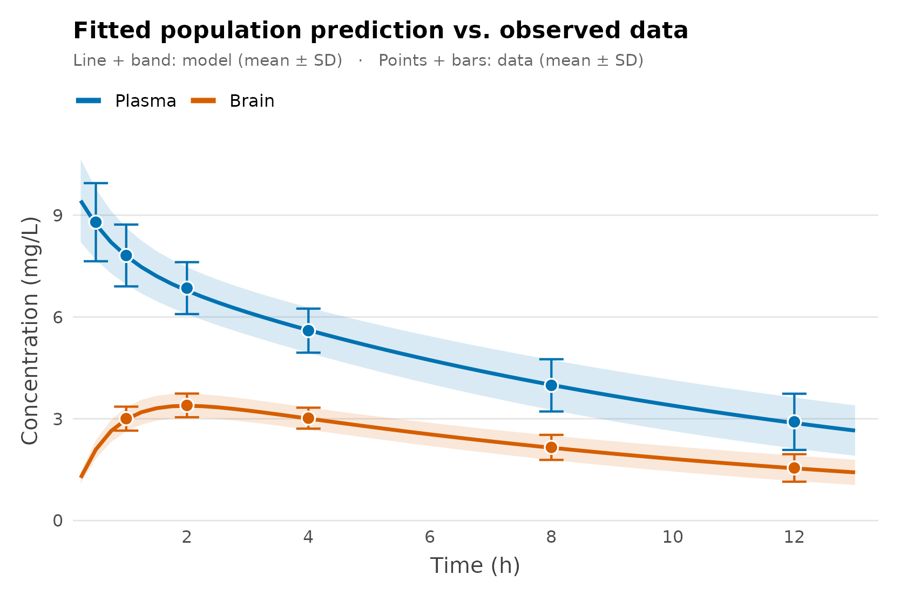
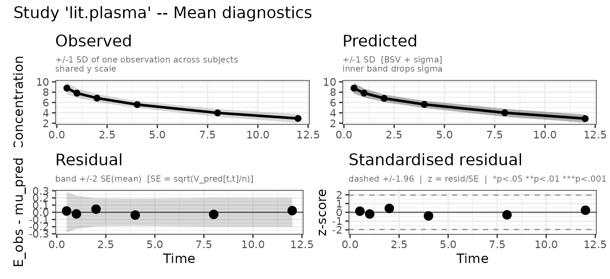
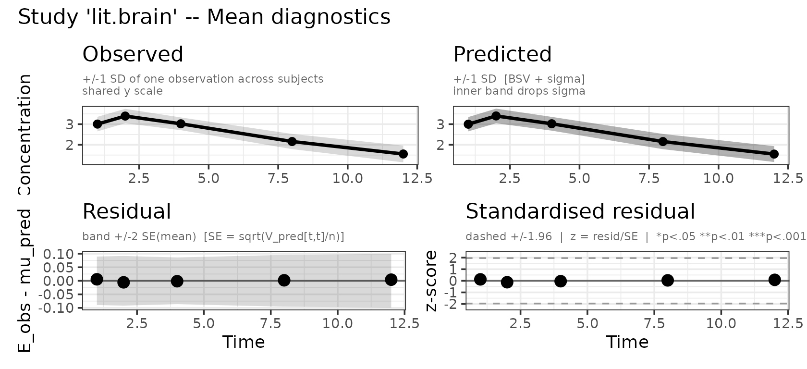

# Several observed compartments (plasma and brain)

## The problem

You are developing a CNS drug and you want one number: **how much of it
reaches the brain?** There is no patient-level data, only a published
paper with two figures — a **plasma** and a **brain** concentration–time
curve, each a mean with error bars, which you digitise into a mean and
an SD per sampling time.

That summary is what admixr2 is built for: it fits a population PK model
directly to means and covariances, so a digitised figure is a fittable
dataset. Two steps:

1.  **Plasma only** — the ordinary single-output workflow, to set the
    scene.
2.  **Plasma + brain** — add the brain as a second observed output and
    read the brain-penetration ratio straight off the fit.

``` r

library(admixr2)
library(rxode2)
library(nlmixr2)
library(ggplot2)

ev <- rxode2::et(amt = 100, cmt = "central")   # single 100-unit dose, shared throughout
```

## Step 1 — Plasma only

Start where every PK analysis starts: the plasma curve. A **study** is
the digitised summary bundled with its design — the mean vector `E`, its
variance `V` (here `SD^2`, read as a diagonal covariance, which is all
error bars give you), the sample size `n`, the sampling `times` and the
dosing `ev`.

``` r

plasma_times <- c(0.5, 1, 2, 4, 8, 12)
plasma_mean  <- c(8.793, 7.812, 6.850, 5.597, 3.985, 2.910)
plasma_sd    <- c(1.151, 0.911, 0.765, 0.649, 0.770, 0.828)

plasma_study <- list(
  E = plasma_mean, V = plasma_sd^2, n = 60L,
  times = plasma_times, ev = ev
)
```

An ordinary two-compartment model with one observed output, `cp`, fitted
in one call to `nlmixr2()` with admixr2’s Gauss–Hermite estimator:

``` r
pk_plasma <- function() {
  ini({
    tcl <- log(1);  tv1 <- log(10);  tq <- log(3);  tv2 <- log(8)
    prop.cp <- 0.05
    eta.cl ~ 0.09
    eta.v1 ~ 0.04
  })
  model({
    cl <- exp(tcl + eta.cl); v1 <- exp(tv1 + eta.v1)
    q  <- exp(tq);           v2 <- exp(tv2)
    d/dt(central) <- -(cl/v1)*central - (q/v1)*central + (q/v2)*periph
    d/dt(periph)  <-  (q/v1)*central - (q/v2)*periph
    cp <- central / v1
    cp ~ prop(prop.cp)
  })
}

fit_plasma <- nlmixr2(pk_plasma, admData(), est = "adgh",
                      control = adghControl(studies = list(trial = plasma_study)))
fit_plasma
── nlmixr² adgh ──

         OBJF      AIC      BIC Log-likelihood
adgh 229.6289 243.6289 270.8316      -114.8144

── Time (sec fit_plasma$time): ──

        optimize covariance other elapsed other
elapsed    0.413      0.136     0   0.549 3.583

── Population Parameters (fit_plasma$parFixed or fit_plasma$parFixedDf): ──

            Est.       SE   %RSE       Back-transformed(95%CI) BSV(CV%)
tcl      0.03322  0.03552  106.9         1.034 (0.9643, 1.108)    27.92
tv1        2.292  0.01961 0.8557          9.890 (9.517, 10.28)    15.12
tq        0.8830  0.05657  6.406          2.418 (2.164, 2.702)         
tv2       0.8678  0.02628  3.028          2.382 (2.262, 2.507)         
prop.cp 0.004104 0.001770  43.13 0.004104 (6.351e-4, 0.007573)         
        Shrink(SD)%
tcl             NaN
tv1             NaN
tq                 
tv2                
prop.cp            
 
  Covariance Type (fit_plasma$covMethod): r,s
  No correlations in between subject variability (BSV) matrix
  Full BSV covariance (fit_plasma$omega) 
    or correlation (fit_plasma$omegaR; diagonals=SDs)
  Distribution stats (mean/skewness/kurtosis/p-value) available in $shrink 
  Information about run found (fit_plasma$runInfo):
   • covMethod = "r,s": the Hessian is ill-conditioned (rcond 2.2e-07, cond 4.47e+06), and the sandwich inverts it twice where "r" inverts it once -- so the correction is amplified quadratically in the weakly-identified direction, which loads mainly on `prop.cp`. Check that parameter's relative standard error before reading its "r,s" value as a finding; the well-determined parameters are unaffected. 
   • admixr2: prop.cp finished on the gradient box constraint (grad_bounds = 5 from the starting value), not at an interior optimum. The reported estimate and SE are those of a constrained fit. Widen grad_bounds, or start closer to the expected value. 
  Censoring (fit_plasma$censInformation): No censoring
  Minimization message (fit_plasma$message):  
    NLOPT_FTOL_REACHED: Optimization stopped because ftol_rel or ftol_abs (above) was reached. 
```

A perfectly good plasma model — and look at what it cannot answer.
`periph` is a mathematical distribution store: never measured, and
connected to the brain by nothing. Brain exposure needs brain data
**and** a real brain compartment.

## Step 2 — Add the brain

Here are the brain concentrations digitised from the same paper:

``` r

brain_times <- c(1, 2, 4, 8, 12)
brain_mean  <- c(3.004, 3.394, 3.018, 2.157, 1.551)
brain_sd    <- c(0.353, 0.349, 0.309, 0.369, 0.405)
```

Swap the anonymous peripheral compartment for a **mechanistic brain
compartment**: drug moves plasma → brain with influx clearance `qin` and
back with efflux clearance `qout`. The steady-state brain:plasma ratio
is what we are after:

``` math
K_{p,uu} = \frac{q_{in}}{q_{out}}
```

With **two** observed outputs — plasma `cp` and brain `cb` — the model
carries a residual-error term for each. (`vb`, the brain volume, is a
fixed physiological constant, not an estimated parameter.)

``` r

pk_cns <- function() {
  ini({
    tcl  <- log(1);  tv1  <- log(10)
    tqin <- log(3);  tqout <- log(6)
    prop.cp <- 0.05      # plasma residual (proportional)
    add.cb  <- 0.02      # brain residual (additive)
    eta.cl ~ 0.09
    eta.v1 ~ 0.04
  })
  model({
    cl <- exp(tcl + eta.cl); v1 <- exp(tv1 + eta.v1)
    qin <- exp(tqin);        qout <- exp(tqout)
    vb  <- 5
    d/dt(central) <- -(cl/v1)*central - (qin/v1)*central + (qout/vb)*brain
    d/dt(brain)   <-  (qin/v1)*central - (qout/vb)*brain
    cp <- central / v1        # plasma concentration
    cb <- brain   / vb        # brain concentration
    cp ~ prop(prop.cp)
    cb ~ add(add.cb)
  })
}
```

Two outputs means two summaries. In place of a single `E`/`V`, give the
study an **`observations` list** — one named entry per observed
compartment, pairing a model output with its own `times`, `E` and `V`:

``` r

cns_study <- list(
  n = 60L, ev = ev,
  observations = list(
    plasma = list(output = "cp", times = plasma_times, E = plasma_mean, V = plasma_sd^2),
    brain  = list(output = "cb", times = brain_times,  E = brain_mean,  V = brain_sd^2)
  )
)
```

The only other change is telling
[`admData()`](https://leidenpharmacology.github.io/admixr2/reference/admData.md)
which outputs to expect; the fit call is otherwise identical to Step 1:

``` r
fit_cns <- nlmixr2(pk_cns, admData(c("cp", "cb")), est = "adgh",
                   control = adghControl(studies = list(lit = cns_study)))
fit_cns
── nlmixr² adgh ──

          OBJF       AIC       BIC Log-likelihood
adgh -88.64046 -72.64046 -36.70254       44.32023

── Time (sec fit_cns$time): ──

        optimize covariance other elapsed other
elapsed     0.63      0.245     0   0.875 2.581

── Population Parameters (fit_cns$parFixed or fit_cns$parFixedDf): ──

           Est.      SE   %RSE     Back-transformed(95%CI) BSV(CV%) Shrink(SD)%
tcl     0.04081 0.02782  68.16       1.042 (0.9864, 1.100)    27.09         NaN
tv1       2.269 0.01524 0.6718        9.672 (9.388, 9.966)    13.98         NaN
tqin      1.085 0.03279  3.023        2.958 (2.774, 3.154)                     
tqout     1.780 0.03718  2.089        5.929 (5.512, 6.377)                     
prop.cp 0.04449 0.03352  75.35  0.04449 (-0.02121, 0.1102)                     
add.cb  0.01997 0.01843  92.27 0.01997 (-0.01614, 0.05609)                     
 
  Covariance Type (fit_cns$covMethod): r,s
  No correlations in between subject variability (BSV) matrix
  Full BSV covariance (fit_cns$omega) 
    or correlation (fit_cns$omegaR; diagonals=SDs)
  Distribution stats (mean/skewness/kurtosis/p-value) available in $shrink 
  Information about run found (fit_cns$runInfo):
   • covMethod = "r,s": the Hessian is ill-conditioned (rcond 2.5e-07, cond 4.01e+06), and the sandwich inverts it twice where "r" inverts it once -- so the correction is amplified quadratically in the weakly-identified direction, which loads mainly on `add.cb`. Check that parameter's relative standard error before reading its "r,s" value as a finding; the well-determined parameters are unaffected. 
  Censoring (fit_cns$censInformation): No censoring
  Minimization message (fit_cns$message):  
    NLOPT_FTOL_REACHED: Optimization stopped because ftol_rel or ftol_abs (above) was reached. 
```

## The same study in long format

If you have used nlmixr2’s [multiple
endpoints](https://nlmixr2.org/articles/multiple-endpoints.html), the
`observations` list may feel like a detour: nlmixr2 stacks observations
in **one** data frame and labels each row with its endpoint (`DVID` /
`CMT`).

admixr2 takes a study written that way too — a `data` frame with one row
per observed *endpoint × time*: an endpoint column (`DVID`, `CMT` or
`output`), a time column (`TIME`), the mean (`E`) and its variance (`V`,
or an `SD` column):

``` r

cns_long <- list(
  n = 60L, ev = ev,
  data = data.frame(
    DVID = c(rep("cp", length(plasma_times)), rep("cb", length(brain_times))),
    TIME = c(plasma_times, brain_times),
    E    = c(plasma_mean,  brain_mean),
    V    = c(plasma_sd,    brain_sd)^2
  )
)
```

The same study, written differently: admixr2 normalises it into the same
likelihood blocks, so the fits agree to the last digit.

``` r
fit_long <- nlmixr2(pk_cns, admData(c("cp", "cb")), est = "adgh",
                    control = adghControl(studies = list(lit = cns_long)))

c(observations = fit_cns$objective, long = fit_long$objective)
observations         long 
   -88.64046    -88.64046 
```

Which to use is taste. `observations` keeps each compartment’s design
visibly together, the natural way to write a study *by hand*. Long
format is the natural way to write one *from data* — the shape summaries
already have in a spreadsheet or out of a `dplyr` pipeline, and the
shape nlmixr2 itself uses.

### Same-subject data: one stacked covariance

Long format earns its keep when plasma and brain were measured in the
**same subjects**. The two curves are then correlated, and that
correlation is information the fit should use — but it lives *between*
the compartments, where per-compartment `V` matrices have nowhere to put
it.

Long format does: every observation being a row, the study takes **one**
covariance matrix spanning all of them, aligned with the rows of `data`
— exactly what `cov.wt(dv_mat, method = "ML")$cov` returns from the
subject-level matrix (one row per subject, one column per observation,
plasma columns then brain).

``` r

cns_joint <- list(
  n = 60L, ev = ev,
  data = data.frame(
    DVID = c(rep("cp", length(plasma_times)), rep("cb", length(brain_times))),
    TIME = c(plasma_times, brain_times),
    E    = c(plasma_mean,  brain_mean)
  ),
  V = V_joint   # 11 x 11: plasma block, brain block, and the cross-covariance
)
```

admixr2 then scores all 11 observations with a **single** multivariate
normal, simulating both compartments from shared random effects. A
study-level `V` is what marks the study same-subject; without one each
endpoint stays an independent block. (`observations` can express this
too, via a `cross` list of per-pair blocks — see
[`?admControl`](https://leidenpharmacology.github.io/admixr2/reference/admControl.md)
— but assembling those by hand is the chore long format removes.)

The choice is a **modelling** decision, not a formatting one: a joint
fit with zero cross-covariances is *not* two independent blocks. The
model predicts plasma and brain to co-vary, sharing `eta.cl` and
`eta.v1`, so telling it you observed no covariance is a real statement
about the data and the likelihood will hold you to it. Joint when the
compartments came from the same subjects, independent when they did not
— here, two separate figures.

### Model against data

One fit now describes both compartments. Below, the observed summaries
(points, mean ± SD) sit under the fitted population prediction — the
mean curve and the ±SD band implied by the estimated between-subject
variability, over 1000 simulated subjects with residual error excluded.

``` r

# 1. Pull the fitted estimates from the fit (standard nlmixr2 accessors).
theta <- fit_cns$theta   # fixed effects (tcl, tv1, tqin, tqout, residuals)
omega <- fit_cns$omega   # between-subject covariance (rows/cols already named)

# 2. Simulate the fitted population. We solve a plain, residual-free copy of the
#    model so the band shows between-subject variability alone -- and because a
#    multi-endpoint fit can only be re-solved with per-endpoint DVID/CMT tags,
#    whereas this gives cp and cb directly.
sim_model <- rxode2::rxode2({
  cl <- exp(tcl + eta.cl); v1 <- exp(tv1 + eta.v1)
  qin <- exp(tqin); qout <- exp(tqout); vb <- 5
  d/dt(central) <- -(cl/v1)*central - (qin/v1)*central + (qout/vb)*brain
  d/dt(brain)   <-  (qin/v1)*central - (qout/vb)*brain
  cp <- central / v1
  cb <- brain / vb
})
grid <- seq(0.25, 13, by = 0.25)
sim  <- rxode2::rxSolve(sim_model,
  params = theta[c("tcl", "tv1", "tqin", "tqout")],
  omega  = omega, nSub = 1000L,
  events = ev |> rxode2::et(grid), returnType = "data.frame")

# 3. Summarise model and data as mean +/- SD per time, per compartment.
band <- function(value)
  data.frame(time = sort(unique(sim$time)),
             mean = tapply(value, sim$time, mean),
             sd   = tapply(value, sim$time, sd))

pred <- rbind(cbind(compartment = "Plasma", band(sim$cp)),
              cbind(compartment = "Brain",  band(sim$cb)))
obs  <- rbind(
  data.frame(compartment = "Plasma", time = plasma_times, mean = plasma_mean, sd = plasma_sd),
  data.frame(compartment = "Brain",  time = brain_times,  mean = brain_mean,  sd = brain_sd))

# 4. Model (line + band) over data (points + error bars), coloured by compartment.
pal <- c(Plasma = "#0072B2", Brain = "#D55E00")   # Okabe-Ito, colour-blind safe

ggplot() +
  geom_ribbon(data = pred,
              aes(time, ymin = mean - sd, ymax = mean + sd, fill = compartment),
              alpha = 0.15) +
  geom_line(data = pred,
            aes(time, mean, colour = compartment), linewidth = 1) +
  geom_errorbar(data = obs,
                aes(time, ymin = mean - sd, ymax = mean + sd, colour = compartment),
                width = 0.4, linewidth = 0.6, show.legend = FALSE) +
  geom_point(data = obs,
             aes(time, mean, fill = compartment),
             shape = 21, colour = "white", size = 3, stroke = 0.7) +
  scale_colour_manual(values = pal, breaks = c("Plasma", "Brain")) +
  scale_fill_manual(values = pal, guide = "none") +
  scale_x_continuous(breaks = seq(0, 12, 2),
                     expand = expansion(mult = c(0.01, 0.03))) +
  scale_y_continuous(expand = expansion(mult = c(0, 0.05))) +
  coord_cartesian(ylim = c(0, NA), clip = "off") +
  guides(colour = guide_legend(override.aes = list(linewidth = 1.4))) +
  labs(x = "Time (h)", y = "Concentration (mg/L)",
       title = "Fitted population prediction vs. observed data",
       subtitle = "Line + band: model (mean ± SD)   ·   Points + bars: data (mean ± SD)",
       colour = NULL) +
  theme_minimal(base_size = 12) +
  theme(
    legend.position = "top",
    legend.justification = "left",
    legend.margin = margin(b = 2),
    plot.title = element_text(face = "bold", size = 13),
    plot.subtitle = element_text(colour = "grey40", size = 9, margin = margin(b = 9)),
    axis.title = element_text(colour = "grey25"),
    axis.title.x = element_text(margin = margin(t = 6)),
    axis.title.y = element_text(margin = margin(r = 6)),
    panel.grid.minor = element_blank(),
    panel.grid.major.x = element_blank(),
    panel.grid.major.y = element_line(colour = "grey90", linewidth = 0.4),
    plot.margin = margin(12, 16, 10, 12)
  )
```



The prediction tracks both compartments. Now the payoff, read straight
off the estimates:

``` r

Kp_uu <- exp(theta[["tqin"]]) / exp(theta[["tqout"]])
round(Kp_uu, 2)
#> [1] 0.5
```

`Kp,uu` ≈ 0.5: at steady state the brain sees about half the plasma
concentration. This is why the brain data was needed at all — with
plasma alone `qin` and `qout` are not separately identifiable, and
`Kp,uu` cannot be estimated.

### Built-in diagnostics

That overlay was assembled by hand for a custom figure. You don’t have
to: [`plot()`](https://rdrr.io/r/graphics/plot.default.html) draws
observed-vs-predicted panels directly, one per observed output.

``` r

plot(fit_cns, which = "mean")
```



## Notes

- **Estimators.** `adgh` (used here), `adfo` and `admc` support several
  observed outputs, each with its own analytical / sensitivity gradient.
  `adirmc` does not. See the [estimator
  comparison](https://leidenpharmacology.github.io/admixr2/articles/estimator-comparison.md)
  to choose.
- **Structural vs. observed compartments.** How many compartments the
  ODEs hold is irrelevant; what counts is how many outputs you *observe*
  and fit — one in Step 1, two in Step 2.
- **Hard-coded constants** such as `vb <- 5` keep their value. Not every
  physiological constant has to be estimated.
- **Two ways to write a study.** `observations` and the long-format
  `data` frame are interchangeable: same normalisation, same likelihood,
  same numbers. Independent experiments can also carry a per-endpoint
  `n` column and a per-endpoint `ev`, a list of event tables keyed by
  endpoint.
- **Same-subject data.** Plasma and brain came from separate figures
  here, so they are independent likelihood blocks. Measured in the
  *same* subjects, supply the cross-covariance instead — one stacked `V`
  in long format, or a per-output-pair `cross` list with `observations`;
  see
  [`?admControl`](https://leidenpharmacology.github.io/admixr2/reference/admControl.md).

## See also

- [PD and PK/PD
  data](https://leidenpharmacology.github.io/admixr2/articles/pkpd.md) —
  add a pharmacodynamic endpoint
- [Multiple
  studies](https://leidenpharmacology.github.io/admixr2/articles/multiple-studies.md)
  — meta-analysis across studies
- [Diagnostic
  plots](https://leidenpharmacology.github.io/admixr2/articles/diagnostic-plots.md)
