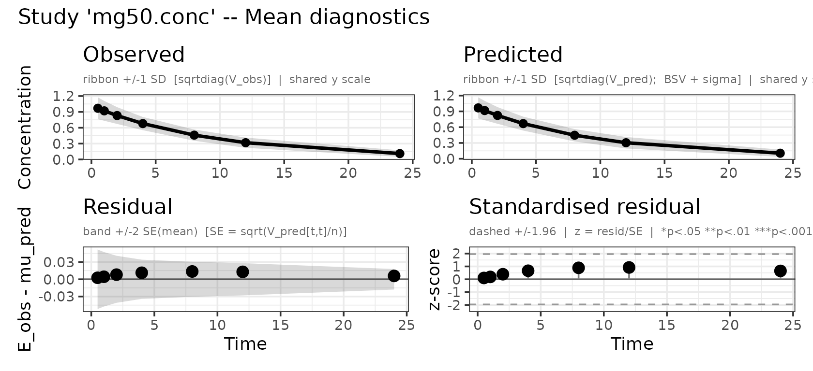
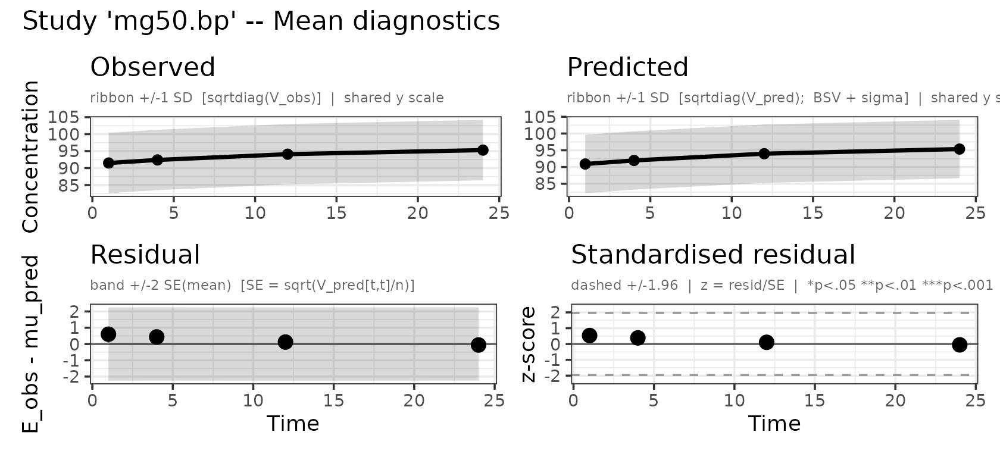
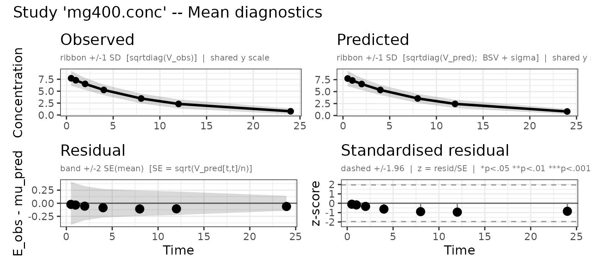
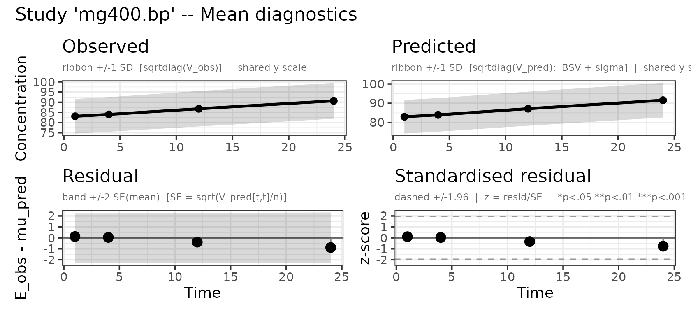
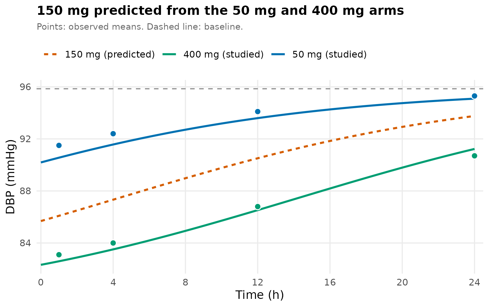

# PD and PK/PD data

## The problem

A blood-pressure trial reports two doses, 50 mg and 400 mg. You are
choosing a dose for the next study and you want **150 mg**, which nobody
measured. This vignette fits a PK/PD model to the two published arms and
predicts the arm that was never run.

``` r

library(admixr2)
library(rxode2)
library(nlmixr2)
library(ggplot2)
```

## The data

Two dose arms, 60 subjects each. Each arm reports a plasma
concentration–time curve and a diastolic blood pressure (DBP) curve.
Concentrations are sampled at seven times, DBP at four — PD is usually
measured more sparsely than PK, and admixr2 does not require the two to
share a grid:

``` r

pk_times <- c(0.5, 1, 2, 4, 8, 12, 24)
pd_times <- c(1, 4, 12, 24)

# 50 mg arm
conc50_mean <- c(0.969, 0.920, 0.831, 0.679, 0.460, 0.317, 0.111)  # mg/L
conc50_sd   <- c(0.207, 0.188, 0.159, 0.125, 0.106, 0.097, 0.062)
dbp50_mean  <- c(91.5, 92.4, 94.1, 95.3)                           # mmHg
dbp50_sd    <- c( 8.9,  8.9,  8.9,  8.9)

# 400 mg arm
conc400_mean <- c(7.709, 7.291, 6.528, 5.256, 3.462, 2.326, 0.780)
conc400_sd   <- c(1.557, 1.440, 1.270, 1.106, 1.027, 0.951, 0.599)
dbp400_mean  <- c(83.1, 84.0, 86.8, 90.7)
dbp400_sd    <- c( 8.5,  8.5,  8.7,  8.8)
```

These two arms are a simulated 60-subject study, drawn from a known
model — CL = 5 L/h, V = 50 L, baseline DBP = 95 mmHg, Emax = 15 mmHg,
EC50 = 2 mg/L — so the 150 mg prediction can be checked against a truth
at the end. Being a sample rather than the population, the numbers carry
the scatter any 60-subject trial would. A digitised figure gives you
exactly these fields.

By 24 h the 50 mg arm is back at its baseline with the drug almost gone
(0.1 mg/L); the 400 mg arm is still about 4 mmHg below it. The DBP
standard deviations barely move across time because the spread is
dominated by between-subject differences in *baseline* blood pressure,
which are the same people at every visit.

These are standard deviations. Published figures often plot a standard
*error* or a model-based least-squares-mean SE instead, which must be
converted first — see [From a published figure to E, V and
n](https://leidenpharmacology.github.io/admixr2/articles/aggregate-data.md).

## The model

A one-compartment model with a direct-effect `Emax` term acting to
*lower* DBP. Two observed outputs make this a multiple-endpoint model,
so it carries a residual error term for each, exactly as in [Several
observed
compartments](https://leidenpharmacology.github.io/admixr2/articles/multi-compartment.md):

``` r

pkpd_model <- function() {
  ini({
    tcl     <- log(4)  ; label("Log clearance (L/h)")
    tv      <- log(40) ; label("Log volume (L)")
    te0     <- log(90) ; label("Log baseline DBP (mmHg)")
    temax   <- log(10) ; label("Log maximum DBP reduction (mmHg)")
    tec50   <- log(1)  ; label("Log EC50 (mg/L)")
    prop.cp <- 0.1     ; label("Proportional residual error, concentration")
    add.dbp <- 3       ; label("Additive residual error, DBP (mmHg)")
    eta.cl ~ 0.09
    eta.v  ~ 0.04
    eta.e0 ~ 0.007
  })
  model({
    cl   <- exp(tcl + eta.cl)
    v    <- exp(tv  + eta.v)
    e0   <- exp(te0 + eta.e0)   # baseline DBP
    emax <- exp(temax)
    ec50 <- exp(tec50)
    d/dt(central) <- -(cl/v) * central
    cp  <- central / v                          # output 1: concentration
    dbp <- e0 - emax * cp / (ec50 + cp)         # output 2: DBP (drug lowers it)
    cp  ~ prop(prop.cp)
    dbp ~ add(add.dbp)
  })
}
```

A few points to note:

- Each observed output carries its own residual error term (`prop.cp`,
  `add.dbp`). This is ordinary nlmixr2 multiple-endpoint syntax.
- `e0` is the baseline. There is no pre-dose DBP observation here, so
  `e0` is identified by extrapolating the Emax curve to zero
  concentration. The 50 mg arm’s 24 h point, where the drug contributes
  about 5% of `emax`, is what keeps that extrapolation short. A pre-dose
  observation or a placebo arm is the robust way to pin a baseline;
  without one, `e0` and `emax` trade off.
- The drug enters with a minus sign because it lowers DBP, so `emax` is
  the maximum *reduction*, in mmHg.
- `emax` and `ec50` carry no `eta`: the reported DBP SDs are nearly flat
  across time and dose, which carries little information about
  PD-parameter IIV, and `eta.e0` already reproduces the observed spread.

## Assembling the study specification

Each study gives one `observations` entry per observed output, naming
the model variable it corresponds to and its own `times`, `E` and `V`:

``` r

study50 <- list(
  n = 60L, ev = rxode2::et(amt = 50, cmt = "central"),
  observations = list(
    conc = list(output = "cp",  times = pk_times, E = conc50_mean, V = conc50_sd^2),
    bp   = list(output = "dbp", times = pd_times, E = dbp50_mean,  V = dbp50_sd^2)
  ))

study400 <- list(
  n = 60L, ev = rxode2::et(amt = 400, cmt = "central"),
  observations = list(
    conc = list(output = "cp",  times = pk_times, E = conc400_mean, V = conc400_sd^2),
    bp   = list(output = "dbp", times = pd_times, E = dbp400_mean,  V = dbp400_sd^2)
  ))
```

## Fitting

[`admData()`](https://leidenpharmacology.github.io/admixr2/reference/admData.md)
builds the placeholder data frame nlmixr2’s interface expects — the
observations themselves live in the control, not in the data argument —
and takes the names of the observed outputs. Otherwise this is an
ordinary admixr2 fit:

``` r
fit <- nlmixr2(pkpd_model, admData(c("cp", "dbp")), est = "adgh",
               control = adghControl(studies = list(mg50  = study50,
                                                    mg400 = study400)))
fit
── nlmixr² adgh ──

         OBJF      AIC      BIC Log-likelihood
adgh 1749.128 1769.128 1820.981      -874.5638

── Time (sec fit$time): ──

        optimize covariance elapsed other
elapsed    5.755      0.455    6.21 1.523

── Population Parameters (fit$parFixed or fit$parFixedDf): ──

                                         Parameter    Est.      SE   %RSE
tcl                            Log clearance (L/h)   1.595 0.01548 0.9705
tv                                  Log volume (L)    3.91 0.01117 0.2856
te0                        Log baseline DBP (mmHg)   4.563 0.01241  0.272
temax             Log maximum DBP reduction (mmHg)   2.826  0.1148  4.061
tec50                              Log EC50 (mg/L)  0.6859  0.4846  70.65
prop.cp Proportional residual error, concentration 0.09995               
add.dbp        Additive residual error, DBP (mmHg)   3.013               
        Back-transformed(95%CI) BSV(CV%) Shrink(SD)%
tcl         4.927 (4.78, 5.079)     30.6            
tv            49.89 (48.81, 51)     19.2            
te0        95.85 (93.55, 98.21)     8.50            
temax      16.88 (13.48, 21.14)                     
tec50      1.985 (0.768, 5.133)                     
prop.cp                 0.09995                     
add.dbp                   3.013                     
 
  Covariance Type (fit$covMethod): r
  No correlations in between subject variability (BSV) matrix
  Full BSV covariance (fit$omega) or correlation (fit$omegaR; diagonals=SDs) 
  Distribution stats (mean/skewness/kurtosis/p-value) available in fit$shrink 
  Censoring (fit$censInformation): No censoring
  Minimization message (fit$message):  
    NLOPT_XTOL_REACHED: Optimization stopped because xtol_rel or xtol_abs (above) was reached. 
```

[`plot()`](https://rdrr.io/r/graphics/plot.default.html) returns one
observed-vs-predicted panel per observed output:

``` r

plot(fit, which = "mean")
```



## Predicting an unstudied dose

The fit gives the two things the question needs: how a dose becomes a
concentration over time (`cl`, `v`), and how concentration becomes an
effect (`emax`, `ec50`). For this model both are closed form — a bolus
decays exponentially, and the effect follows the concentration
instantly:

``` r

theta <- fit$theta
cl <- exp(theta[["tcl"]]); v    <- exp(theta[["tv"]])
e0 <- exp(theta[["te0"]]); emax <- exp(theta[["temax"]])
ec50 <- exp(theta[["tec50"]])

conc <- function(dose, t) (dose / v) * exp(-(cl / v) * t)
drop <- function(dose, t) { cc <- conc(dose, t); emax * cc / (ec50 + cc) }

# DBP reduction at 1 h, the first sampled PD time
round(c(mg50 = drop(50, 1), mg150 = drop(150, 1), mg400 = drop(400, 1)), 1)
#>  mg50 mg150 mg400 
#>   5.3   9.8  13.3
```

At the first sampled time the model puts 150 mg at **9.8 mmHg** below
baseline, against 5.3 mmHg for 50 mg and 13.3 mmHg for 400 mg. The two
studied arms are the check: the model’s DBP at 1 h is 90.6 and 82.6 mmHg
against the observed 91.5 and 83.1, so the prediction sits on data
rather than beside it.

A naive linear interpolation in dose would put 150 mg at 7.6 mmHg. The
curve gives more, because the response is already flattening: 150 mg
buys much of what 400 mg does.

The whole predicted time course follows, and can be laid over the arms
that were measured:

``` r

tt  <- seq(0, 24, length.out = 200)
pred <- rbind(
  data.frame(t = tt, dbp = e0 - drop( 50, tt), arm = "50 mg (studied)"),
  data.frame(t = tt, dbp = e0 - drop(150, tt), arm = "150 mg (predicted)"),
  data.frame(t = tt, dbp = e0 - drop(400, tt), arm = "400 mg (studied)"))
obs <- rbind(
  data.frame(t = pd_times, dbp = dbp50_mean,  sd = dbp50_sd,  arm = "50 mg (studied)"),
  data.frame(t = pd_times, dbp = dbp400_mean, sd = dbp400_sd, arm = "400 mg (studied)"))

pal <- c("50 mg (studied)"    = "#0072B2",
         "150 mg (predicted)" = "#D55E00",
         "400 mg (studied)"   = "#009E73")

ggplot(pred, aes(t, dbp, colour = arm)) +
  geom_hline(yintercept = e0, linetype = "dashed", colour = "grey55") +
  geom_line(aes(linetype = arm), linewidth = 1) +
  geom_point(data = obs, aes(fill = arm), shape = 21, colour = "white",
             size = 2.6, stroke = 0.7, show.legend = FALSE) +
  scale_colour_manual(values = pal) +
  scale_fill_manual(values = pal) +
  scale_linetype_manual(values = c("50 mg (studied)"    = "solid",
                                   "150 mg (predicted)" = "22",
                                   "400 mg (studied)"   = "solid")) +
  scale_x_continuous(breaks = seq(0, 24, 4),
                     expand = expansion(mult = c(0.01, 0.02))) +
  labs(x = "Time (h)", y = "DBP (mmHg)", colour = NULL, linetype = NULL,
       title = "150 mg predicted from the 50 mg and 400 mg arms",
       subtitle = "Points: observed means. Dashed line: baseline.") +
  theme_minimal(base_size = 12) +
  theme(legend.position = "top", legend.justification = "left",
        plot.title = element_text(face = "bold", size = 13),
        plot.subtitle = element_text(colour = "grey40", size = 9,
                                     margin = margin(b = 9)),
        panel.grid.minor = element_blank())
```



Because the data were simulated, the answer is known. The truth was
`Emax` = 15 mmHg and `EC50` = 2 mg/L; the fit gives 16.9 and 1.99. At 1
h the true 150 mg drop is 8.6 mmHg against the predicted 9.8 — an
overshoot of about 13%. That is what sixty subjects and two dose levels
buy: the right shape and a usable dose, not a precise `Emax`.

A few points to note:

- **The prediction is for a typical subject, not a population mean.**
  [`drop()`](https://rdrr.io/r/base/drop.html) uses `exp(theta)`, i.e. η
  = 0, whereas the estimator matched `E` to a population *mean* — and
  the mean of a nonlinear function is not that function at the mean.
  Here the two agree to about 0.01 mmHg, because the median-to-mean
  shift and the curvature nearly cancel at `eta.v ~ 0.04`. The gap grows
  with IIV, and would matter if `emax` or `ec50` carried an `eta`. For a
  population mean, simulate over the estimated `Omega`.
- **Each arm sweeps a range of concentrations**, because the drug
  clears. That is why a single arm carries more than a static
  dose–response intuition suggests: the 400 mg arm alone spans 0.4–4 ×
  `EC50` and largely identifies `emax` and `ec50` on its own.
- **The 50 mg arm’s job is the baseline.** With 400 mg alone, the lowest
  concentration observed is still ~29% of `emax`, so the drug-free state
  is never approached and `e0` and `emax` trade off. The 50 mg arm’s 24
  h point is the only near-drug-free observation in the data.
- **Check before predicting.** `ec50` is estimated here to 71% RSE —
  identified, but not precisely, and a dose prediction inherits that. A
  `temax`/`tec50` correlation near ±1 would mean the two are trading off
  and the curve’s plateau is not identified at all:

``` r

cv <- fit$cov
if (is.null(cv)) {
  message("Covariance not computed; refit with a larger cov_h_outer.")
} else {
  round(cv["temax", "tec50"] / sqrt(cv["temax", "temax"] * cv["tec50", "tec50"]), 3)
}
#> [1] 0.579
```

## Notes

- **Getting E and V from a paper.** Error bars are not always SDs; see
  [From a published figure to E, V and
  n](https://leidenpharmacology.github.io/admixr2/articles/aggregate-data.md).
- **Which estimators.** `adgh` (used here), `adfo` and `admc` support
  several observed outputs. `adirmc` does not — it errors on
  multi-output models. See the [estimator
  comparison](https://leidenpharmacology.github.io/admixr2/articles/estimator-comparison.md).
- **Same-subject PK and PD.** Here concentration and DBP are independent
  likelihood blocks, as they would be if digitised from two figures. If
  they were measured in the same subjects — usually true in a PK/PD
  study — the two are correlated, and a joint fit with zero
  cross-covariance is not the same as two independent blocks. Supply the
  cross-covariance; see
  [`?admControl`](https://leidenpharmacology.github.io/admixr2/reference/admControl.md)
  and [Several observed
  compartments](https://leidenpharmacology.github.io/admixr2/articles/multi-compartment.md).
- **Delayed effects.** `dbp` responds to `cp` instantly here, which is
  what makes the prediction a formula. If the effect lags concentration,
  use an effect compartment or a turnover model and simulate the
  prediction instead.
- **Placebo arms.** With only active arms, drug effect and the natural
  time course of the disease are confounded. A placebo arm is just
  another study with a zero-amount `ev`.
- **Bounded endpoints.** An additive residual can predict outside the
  range of a bounded score. Rescale or transform the endpoint before
  fitting — note that an estimated
  [`boxCox()`](https://nlmixr2.github.io/rxode2/reference/boxCox.html)/[`yeoJohnson()`](https://nlmixr2.github.io/rxode2/reference/boxCox.html)
  lambda is **not** supported by admixr2: because it has no closed-form
  aggregate mean/variance, the fit stops with an error rather than
  silently approximating it.

## See also

- [Several observed
  compartments](https://leidenpharmacology.github.io/admixr2/articles/multi-compartment.md)
  — multiple outputs and joint fits
- [Multiple
  studies](https://leidenpharmacology.github.io/admixr2/articles/multiple-studies.md)
  — meta-analysis across studies
- [From a published figure to E, V and
  n](https://leidenpharmacology.github.io/admixr2/articles/aggregate-data.md)
