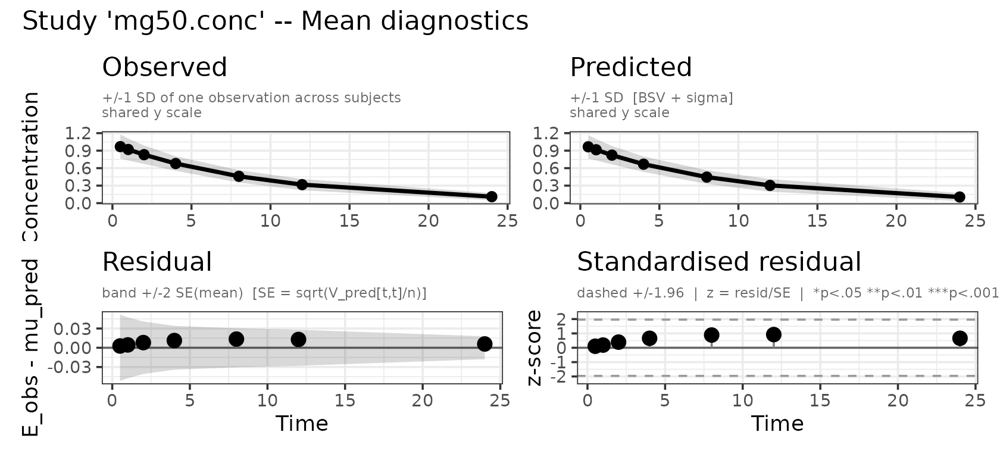
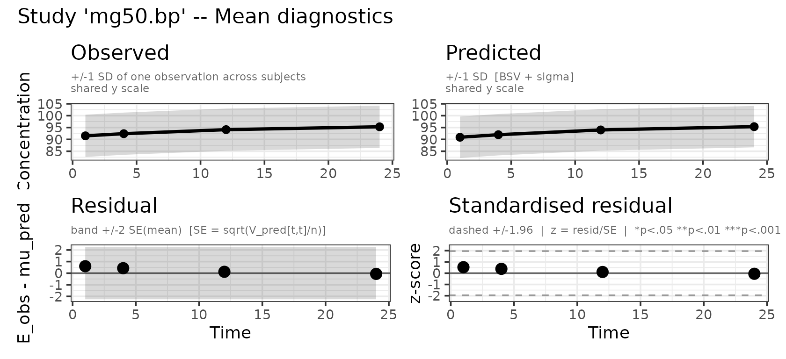
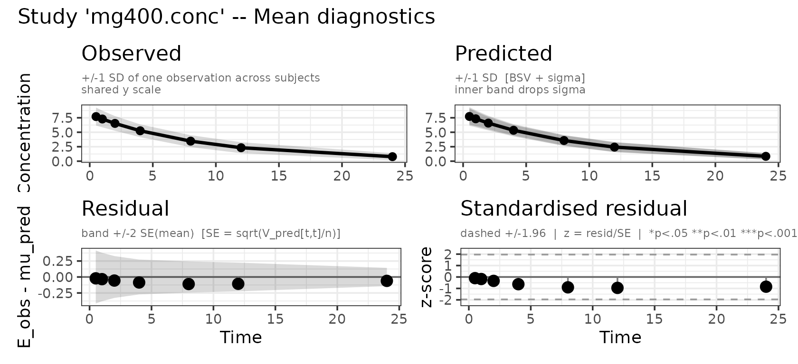
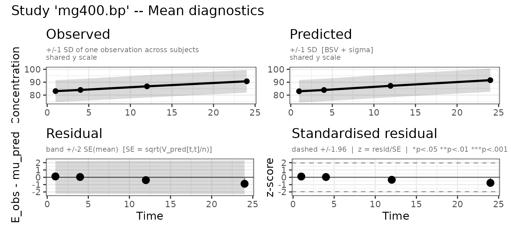
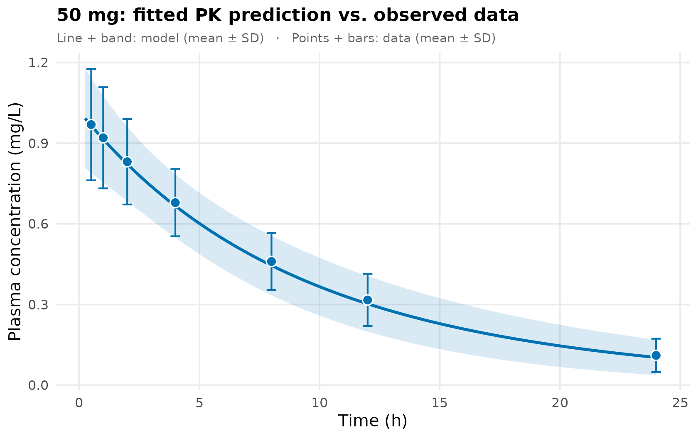
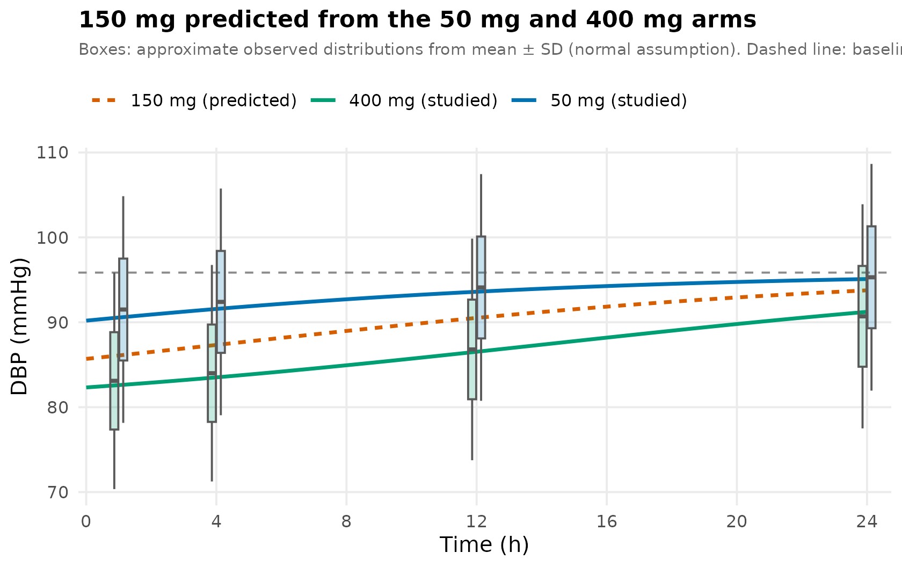

# PD and PK/PD data

## The problem

A blood-pressure trial reports two doses, 50 mg and 400 mg. You are
choosing the dose for the next study and you want **150 mg**, which
nobody measured. This vignette fits a PK/PD model to the two published
arms and predicts the arm that was never run.

``` r

library(admixr2)
library(rxode2)
library(nlmixr2)
library(ggplot2)
```

## The data

Two arms, 60 subjects each, reporting a plasma concentration–time curve
and a diastolic blood pressure (DBP) curve. Concentrations at seven
times, DBP at four: PD is usually measured more sparsely than PK, and
the two need not share a grid.

``` r

pk_times <- c(0.5, 1, 2, 4, 8, 12, 24)
pd_times <- c(1, 4, 12, 24)

# 50 mg arm
conc50_mean <- c(0.969, 0.920, 0.831, 0.679, 0.460, 0.317, 0.111)  # mg/L
conc50_sd   <- c(0.207, 0.188, 0.159, 0.125, 0.106, 0.097, 0.062)
dbp50_mean  <- c(91.5, 92.4, 94.1, 95.3)                           # mmHg
dbp50_sd    <- c( 8.9,  8.9,  8.9,  8.9)

# 400 mg arm
conc400_mean <- c(7.709, 7.291, 6.528, 5.256, 3.462, 2.326, 0.780)
conc400_sd   <- c(1.557, 1.440, 1.270, 1.106, 1.027, 0.951, 0.599)
dbp400_mean  <- c(83.1, 84.0, 86.8, 90.7)
dbp400_sd    <- c( 8.5,  8.5,  8.7,  8.8)
```

Both arms are simulated from a known model — CL = 5 L/h, V = 50 L,
baseline DBP = 95 mmHg, Emax = 15 mmHg, EC50 = 2 mg/L — so the 150 mg
prediction can be checked against a truth at the end. Being a sample
rather than the population, the numbers carry the scatter any 60-subject
trial would. A digitised figure gives you exactly these fields.

By 24 h the 50 mg arm is back at baseline with the drug almost gone (0.1
mg/L), while the 400 mg arm is still about 4 mmHg below it. The DBP
standard deviations barely move across time, the spread being dominated
by between-subject differences in *baseline* blood pressure — the same
people at every visit.

These are standard deviations. Published figures often plot a standard
*error* or a model-based least-squares-mean SE, which must be converted
first; see [From a published figure to E, V and
n](https://leidenpharmacology.github.io/admixr2/articles/aggregate-data.md).

## The model

One compartment with a direct-effect `Emax` term that *lowers* DBP. Two
observed outputs make it a multiple-endpoint model, carrying a residual
error term for each, as in [Several observed
compartments](https://leidenpharmacology.github.io/admixr2/articles/multi-compartment.md):


The arrow carries plasma concentration `cp` into the direct effect:
`DBP = E0 - Emax * cp / (EC50 + cp)`.

``` r

pkpd_model <- function() {
  ini({
    tcl     <- log(4)  ; label("Log clearance (L/h)")
    tv      <- log(40) ; label("Log volume (L)")
    te0     <- log(90) ; label("Log baseline DBP (mmHg)")
    temax   <- log(10) ; label("Log maximum DBP reduction (mmHg)")
    tec50   <- log(1)  ; label("Log EC50 (mg/L)")
    prop.cp <- 0.1     ; label("Proportional residual error, concentration")
    add.dbp <- 3       ; label("Additive residual error, DBP (mmHg)")
    eta.cl ~ 0.09
    eta.v  ~ 0.04
    eta.e0 ~ 0.007
  })
  model({
    cl   <- exp(tcl + eta.cl)
    v    <- exp(tv  + eta.v)
    e0   <- exp(te0 + eta.e0)   # baseline DBP
    emax <- exp(temax)
    ec50 <- exp(tec50)
    d/dt(central) <- -(cl/v) * central
    cp  <- central / v                          # output 1: concentration
    dbp <- e0 - emax * cp / (ec50 + cp)         # output 2: DBP (drug lowers it)
    cp  ~ prop(prop.cp)
    dbp ~ add(add.dbp)
  })
}
```

A few points to note:

- Each output carries its own residual error term (`prop.cp`, `add.dbp`)
  — ordinary nlmixr2 multiple-endpoint syntax.
- `e0` is the baseline. With no pre-dose DBP observation it is
  identified by extrapolating the Emax curve to zero concentration, and
  the 50 mg arm’s 24 h point — where the drug contributes about 5% of
  `emax` — is what keeps that extrapolation short. A pre-dose
  observation or a placebo arm is the robust way to pin a baseline;
  without one, `e0` and `emax` trade off.
- The minus sign is because the drug lowers DBP, so `emax` is the
  maximum *reduction*, in mmHg.
- `emax` and `ec50` carry no `eta`: DBP SDs nearly flat across time and
  dose say little about PD-parameter IIV, and `eta.e0` already
  reproduces the spread.

## Assembling the study specification

One `observations` entry per output, naming the model variable it
corresponds to and its own `times`, `E` and `V`:

``` r

study50 <- list(
  n = 60L, ev = rxode2::et(amt = 50, cmt = "central"),
  observations = list(
    conc = list(output = "cp",  times = pk_times, E = conc50_mean, V = conc50_sd^2),
    bp   = list(output = "dbp", times = pd_times, E = dbp50_mean,  V = dbp50_sd^2)
  ))

study400 <- list(
  n = 60L, ev = rxode2::et(amt = 400, cmt = "central"),
  observations = list(
    conc = list(output = "cp",  times = pk_times, E = conc400_mean, V = conc400_sd^2),
    bp   = list(output = "dbp", times = pd_times, E = dbp400_mean,  V = dbp400_sd^2)
  ))
```

## Fitting

[`admData()`](https://leidenpharmacology.github.io/admixr2/reference/admData.md)
builds the placeholder data frame nlmixr2’s interface expects, and takes
the names of the observed outputs — the observations themselves live in
the control, not the data argument. Otherwise an ordinary admixr2 fit:

``` r
fit <- nlmixr2(pkpd_model, admData(c("cp", "dbp")), est = "adgh",
               control = adghControl(studies = list(mg50  = study50,
                                                    mg400 = study400)))
fit
── nlmixr² adgh ──

         OBJF      AIC      BIC Log-likelihood
adgh 1749.121 1769.121 1820.975      -874.5605

── Time (sec fit$time): ──

        optimize covariance other elapsed other
elapsed    1.613      0.754     0   2.367 4.549

── Population Parameters (fit$parFixed or fit$parFixedDf): ──

                                         Parameter    Est.      SE   %RSE
tcl                            Log clearance (L/h)   1.595 0.02851  1.788
tv                                  Log volume (L)   3.910 0.01830 0.4682
te0                        Log baseline DBP (mmHg)   4.563 0.01338 0.2932
temax             Log maximum DBP reduction (mmHg)   2.826  0.1386  4.903
tec50                              Log EC50 (mg/L)  0.6864  0.1757  25.60
prop.cp Proportional residual error, concentration 0.09973 0.02013  20.18
add.dbp        Additive residual error, DBP (mmHg)   3.012   1.541  51.17
          Back-transformed(95%CI) BSV(CV%) Shrink(SD)%
tcl          4.927 (4.659, 5.210)    30.46         NaN
tv           49.89 (48.14, 51.72)    19.15         NaN
te0          95.85 (93.37, 98.40)    8.498         NaN
temax        16.88 (12.87, 22.15)                     
tec50        1.986 (1.408, 2.803)                     
prop.cp 0.09973 (0.06028, 0.1392)                     
add.dbp  3.012 (-0.008698, 6.034)                     
 
  Covariance Type (fit$covMethod): r,s
  Some strong fixed parameter correlations exist (fit$cor) :
             cor:tv,tcl         cor:te0,tcl       cor:temax,tcl       cor:tec50,tcl 
           -0.0159             -0.0840              -0.104              -0.102  
    cor:prop.cp,tcl     cor:add.dbp,tcl          cor:te0,tv        cor:temax,tv 
           -0.0639              0.0282              0.0665              0.0825  
       cor:tec50,tv      cor:prop.cp,tv      cor:add.dbp,tv       cor:temax,te0 
           -0.0408             -0.0552             -0.0227               0.707  
      cor:tec50,te0     cor:prop.cp,te0     cor:add.dbp,te0     cor:tec50,temax 
            -0.379             0.00817              -0.119             0.00645  
  cor:prop.cp,temax   cor:add.dbp,temax   cor:prop.cp,tec50   cor:add.dbp,tec50 
            0.0103              -0.166             0.00670              0.0752  
cor:add.dbp,prop.cp 
          -0.00291  
 

  No correlations in between subject variability (BSV) matrix
  Full BSV covariance (fit$omega) or correlation (fit$omegaR; diagonals=SDs) 
  Distribution stats (mean/skewness/kurtosis/p-value) available in fit$shrink 
  Information about run found (fit$runInfo):
   • covMethod = "r,s": the Hessian is ill-conditioned (rcond 4.4e-05, cond 2.27e+04), and the sandwich inverts it twice where "r" inverts it once -- so the correction is amplified quadratically in the weakly-identified direction, which loads mainly on `add.dbp`. Check that parameter's relative standard error before reading its "r,s" value as a finding; the well-determined parameters are unaffected. 
   • adghCalcCov: the full Hessian including omega was not positive definite or was numerically singular; reporting structural and sigma standard errors only. 
  Censoring (fit$censInformation): No censoring
  Minimization message (fit$message):  
    NLOPT_FTOL_REACHED: Optimization stopped because ftol_rel or ftol_abs (above) was reached. 
```

[`plot()`](https://rdrr.io/r/graphics/plot.default.html) returns one
observed-vs-predicted panel per observed output:

``` r

plot(fit, which = "mean")
```



### PK model against data

As in [Several observed
compartments](https://leidenpharmacology.github.io/admixr2/articles/multi-compartment.md),
the line and band show the fitted population mean ± SD. Points and error
bars show the published concentration summaries. The band includes
between-subject variation from `cl` and `v`, but excludes residual
error.

``` r

theta_pk <- fit$theta
omega_pk <- fit$omega[c("eta.cl", "eta.v"), c("eta.cl", "eta.v"), drop = FALSE]
pk_sim <- rxode2::rxSolve(rxode2::rxode2({
  cl <- exp(tcl + eta.cl); v <- exp(tv + eta.v)
  d/dt(central) <- -(cl/v) * central
  cp <- central / v
}), params = theta_pk[c("tcl", "tv")], omega = omega_pk,
  nSub = 1000L,
  events = rxode2::et(amt = 50, cmt = "central") |>
    rxode2::et(seq(0.25, 24, by = 0.25)), returnType = "data.frame")
pk_band <- data.frame(
  time = sort(unique(pk_sim$time)),
  mean = as.vector(tapply(pk_sim$cp, pk_sim$time, mean)),
  sd = as.vector(tapply(pk_sim$cp, pk_sim$time, sd)))
pk_obs <- data.frame(time = pk_times, mean = conc50_mean, sd = conc50_sd)

ggplot() +
  geom_ribbon(data = pk_band,
              aes(time, ymin = mean - sd, ymax = mean + sd),
              fill = "#0072B2", alpha = 0.15) +
  geom_line(data = pk_band, aes(time, mean), colour = "#0072B2", linewidth = 1) +
  geom_errorbar(data = pk_obs,
                aes(time, ymin = mean - sd, ymax = mean + sd),
                colour = "#0072B2", width = 0.4, linewidth = 0.6) +
  geom_point(data = pk_obs, aes(time, mean), shape = 21,
             fill = "#0072B2", colour = "white", size = 3, stroke = 0.7) +
  labs(x = "Time (h)", y = "Plasma concentration (mg/L)",
       title = "50 mg: fitted PK prediction vs. observed data",
       subtitle = "Line + band: model (mean ± SD)   ·   Points + bars: data (mean ± SD)") +
  theme_minimal(base_size = 12) +
  theme(plot.title = element_text(face = "bold", size = 13),
        plot.subtitle = element_text(colour = "grey40", size = 9),
        panel.grid.minor = element_blank())
```



## Predicting an unstudied dose

The fit gives both things the question needs: how a dose becomes a
concentration over time (`cl`, `v`), and how concentration becomes an
effect (`emax`, `ec50`). Here both are closed form — a bolus decays
exponentially and the effect follows instantly:

``` r

theta <- fit$theta
cl <- exp(theta[["tcl"]]); v    <- exp(theta[["tv"]])
e0 <- exp(theta[["te0"]]); emax <- exp(theta[["temax"]])
ec50 <- exp(theta[["tec50"]])

conc <- function(dose, t) (dose / v) * exp(-(cl / v) * t)
drop <- function(dose, t) { cc <- conc(dose, t); emax * cc / (ec50 + cc) }

# DBP reduction at 1 h, the first sampled PD time
round(c(mg50 = drop(50, 1), mg150 = drop(150, 1), mg400 = drop(400, 1)), 1)
#>  mg50 mg150 mg400 
#>   5.3   9.8  13.3
```

At the first sampled time the model puts 150 mg at **9.8 mmHg** below
baseline, against 5.3 mmHg for 50 mg and 13.3 mmHg for 400 mg. The two
studied arms are the check: the model’s DBP at 1 h is 90.6 and 82.6 mmHg
against the observed 91.5 and 83.1, so the prediction sits on data
rather than beside it.

Naive linear interpolation in dose would put 150 mg at 7.6 mmHg. The
curve gives more, the response already flattening: 150 mg buys much of
what 400 mg does.

The whole predicted time course follows, laid over the arms that were
measured:

``` r

tt  <- seq(0, 24, length.out = 200)
pred <- rbind(
  data.frame(t = tt, dbp = e0 - drop( 50, tt), arm = "50 mg (studied)"),
  data.frame(t = tt, dbp = e0 - drop(150, tt), arm = "150 mg (predicted)"),
  data.frame(t = tt, dbp = e0 - drop(400, tt), arm = "400 mg (studied)"))
obs <- rbind(
  data.frame(t = pd_times, dbp = dbp50_mean,  sd = dbp50_sd,  arm = "50 mg (studied)"),
  data.frame(t = pd_times, dbp = dbp400_mean, sd = dbp400_sd, arm = "400 mg (studied)"))

pal <- c("50 mg (studied)"    = "#0072B2",
         "150 mg (predicted)" = "#D55E00",
         "400 mg (studied)"   = "#009E73")

ggplot(pred, aes(t, dbp, colour = arm)) +
  geom_hline(yintercept = e0, linetype = "dashed", colour = "grey55") +
  geom_line(aes(linetype = arm), linewidth = 1) +
  geom_boxplot(data = transform(obs, ymin = dbp - 1.5 * sd,
                                lower = dbp - qnorm(.75) * sd,
                                middle = dbp,
                                upper = dbp + qnorm(.75) * sd,
                                ymax = dbp + 1.5 * sd),
               aes(x = t, ymin = ymin, lower = lower, middle = middle,
                   upper = upper, ymax = ymax, fill = arm,
                   group = interaction(arm, t)),
               stat = "identity", width = 0.55, alpha = 0.22,
               colour = "grey35", inherit.aes = FALSE, show.legend = FALSE) +
  scale_colour_manual(values = pal) +
  scale_fill_manual(values = pal) +
  scale_linetype_manual(values = c("50 mg (studied)"    = "solid",
                                   "150 mg (predicted)" = "22",
                                   "400 mg (studied)"   = "solid")) +
  scale_x_continuous(breaks = seq(0, 24, 4),
                     expand = expansion(mult = c(0.01, 0.02))) +
  labs(x = "Time (h)", y = "DBP (mmHg)", colour = NULL, linetype = NULL,
       title = "150 mg predicted from the 50 mg and 400 mg arms",
       subtitle = "Boxes: approximate observed distributions from mean ± SD (normal assumption). Dashed line: baseline.") +
  theme_minimal(base_size = 12) +
  theme(legend.position = "top", legend.justification = "left",
        plot.title = element_text(face = "bold", size = 13),
        plot.subtitle = element_text(colour = "grey40", size = 9,
                                     margin = margin(b = 9)),
        panel.grid.minor = element_blank())
```



Because the data were simulated, the answer is known. The truth was
`Emax` = 15 mmHg and `EC50` = 2 mg/L; the fit gives 16.9 and 1.99. At 1
h the true 150 mg drop is 8.6 mmHg against the predicted 9.8 — an
overshoot of about 13%. That is what sixty subjects and two dose levels
buy: the right shape and a usable dose, not a precise `Emax`.

A few points to note:

- **This is a typical subject, not a population mean.**
  [`drop()`](https://rdrr.io/r/base/drop.html) uses `exp(theta)`, i.e. η
  = 0, whereas the estimator matched `E` to a population *mean* — and
  the mean of a nonlinear function is not that function at the mean. The
  two agree to about 0.01 mmHg here, the median-to-mean shift and the
  curvature nearly cancelling at `eta.v ~ 0.04`. The gap grows with IIV
  and would matter if `emax` or `ec50` carried an `eta`. For a
  population mean, simulate over the estimated `Omega`.
- **Each arm sweeps a range of concentrations** as the drug clears,
  which is why one arm carries more than a static dose–response
  intuition suggests: 400 mg alone spans 0.4–4 × `EC50` and largely
  identifies `emax` and `ec50`.
- **The 50 mg arm’s job is the baseline.** With 400 mg alone the lowest
  observed concentration is still ~29% of `emax`, so the drug-free state
  is never approached and `e0` and `emax` trade off. The 50 mg arm’s 24
  h point is the only near-drug-free observation there is.
- **Check before predicting.** `ec50` comes back at 26% RSE — identified
  but not precise, and a dose prediction inherits that. A
  `temax`/`tec50` correlation near ±1 would mean the two are trading off
  and the plateau is not identified at all:

``` r

cv <- fit$cov
if (is.null(cv)) {
  message("Covariance not computed; refit with a larger cov_h_outer.")
} else {
  round(cv["temax", "tec50"] / sqrt(cv["temax", "temax"] * cv["tec50", "tec50"]), 3)
}
#> [1] 0.006
```

## Notes

- **Getting E and V from a paper.** Error bars are not always SDs; see
  [From a published figure to E, V and
  n](https://leidenpharmacology.github.io/admixr2/articles/aggregate-data.md).
- **Which estimators.** `adgh` (used here), `adfo` and `admc` support
  several observed outputs; `adirmc` errors on multi-output models. See
  the [estimator
  comparison](https://leidenpharmacology.github.io/admixr2/articles/estimator-comparison.md).
- **Same-subject PK and PD.** Concentration and DBP are independent
  likelihood blocks here, as they would be from two figures. Measured in
  the same subjects — usually the case in a PK/PD study — they are
  correlated, and a joint fit with zero cross-covariance is not two
  independent blocks. Supply the cross-covariance; see
  [`?admControl`](https://leidenpharmacology.github.io/admixr2/reference/admControl.md)
  and [Several observed
  compartments](https://leidenpharmacology.github.io/admixr2/articles/multi-compartment.md).
- **Delayed effects.** `dbp` responds to `cp` instantly, which is what
  makes the prediction a formula. If the effect lags, use an effect
  compartment or a turnover model and simulate instead.
- **Placebo arms.** With only active arms, drug effect and the disease’s
  natural time course are confounded. A placebo arm is just another
  study with a zero-amount `ev`.
- **Bounded endpoints.** An additive residual can predict outside a
  bounded score’s range. Transform instead — `logitNorm()`,
  `probitNorm()`,
  [`boxCox()`](https://nlmixr2.github.io/rxode2/reference/boxCox.html)
  and
  [`yeoJohnson()`](https://nlmixr2.github.io/rxode2/reference/boxCox.html),
  lambda estimated or fixed. See [Choosing a residual error
  model](https://leidenpharmacology.github.io/admixr2/articles/error-models.md).

## See also

- [Several observed
  compartments](https://leidenpharmacology.github.io/admixr2/articles/multi-compartment.md)
  — multiple outputs and joint fits
- [Multiple
  studies](https://leidenpharmacology.github.io/admixr2/articles/multiple-studies.md)
  — meta-analysis across studies
- [From a published figure to E, V and
  n](https://leidenpharmacology.github.io/admixr2/articles/aggregate-data.md)
